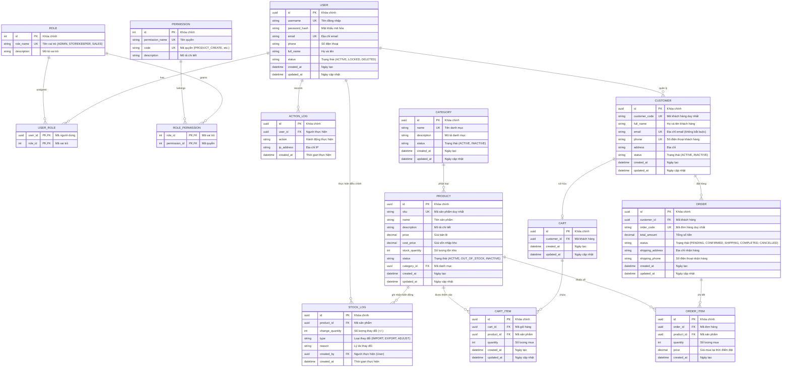
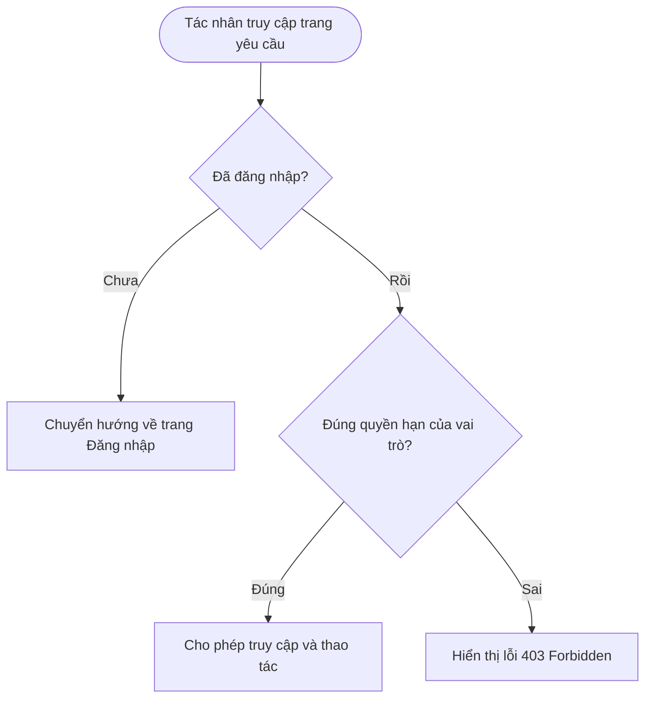
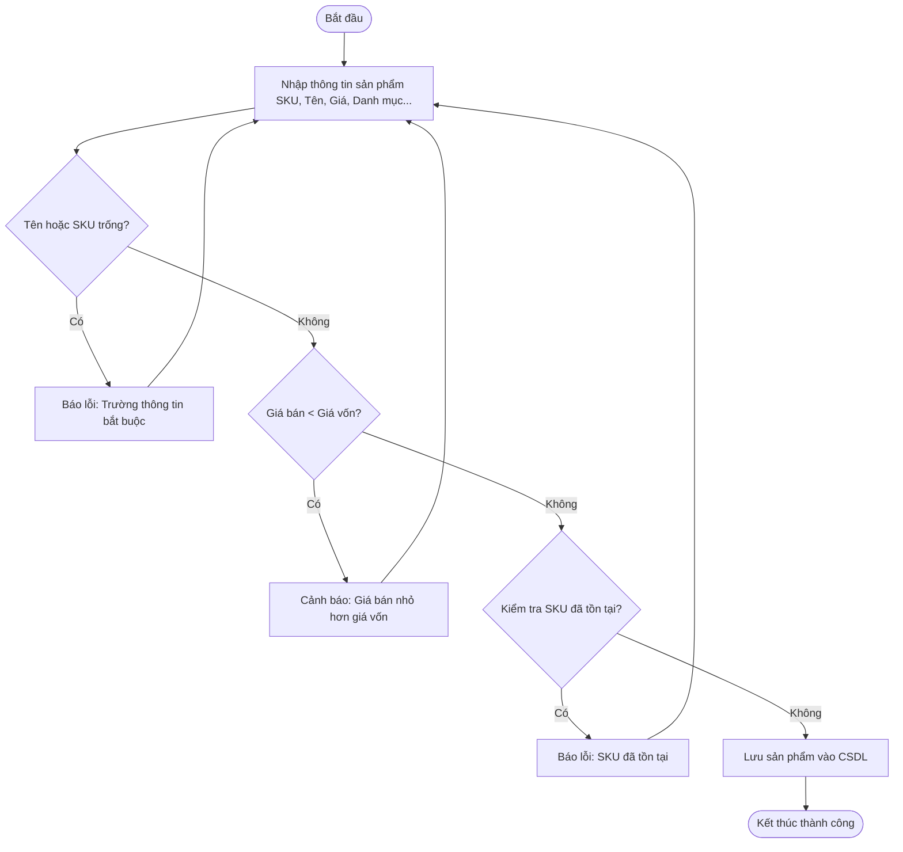
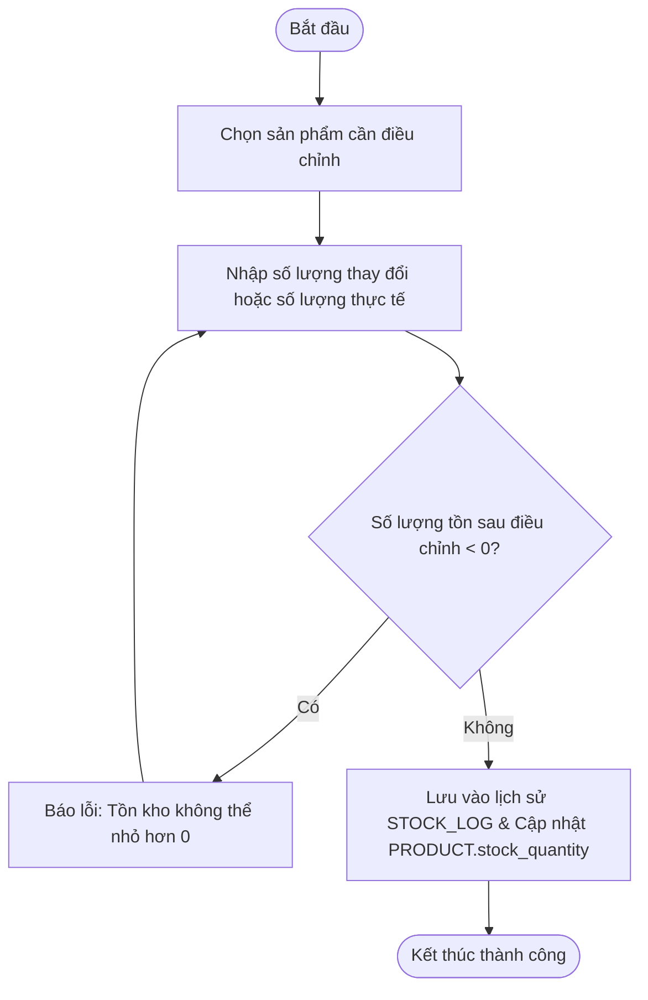
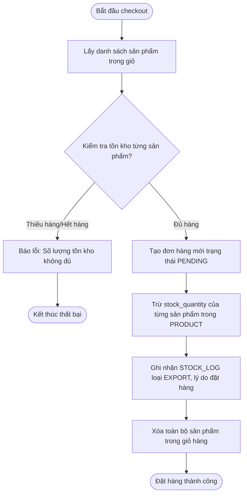
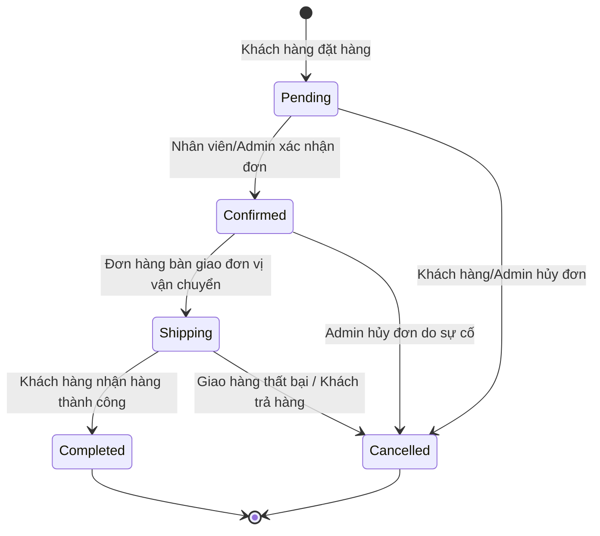
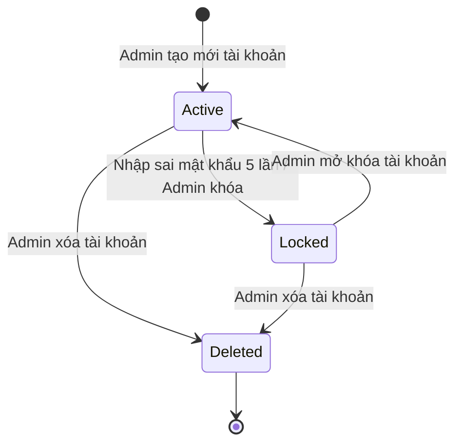
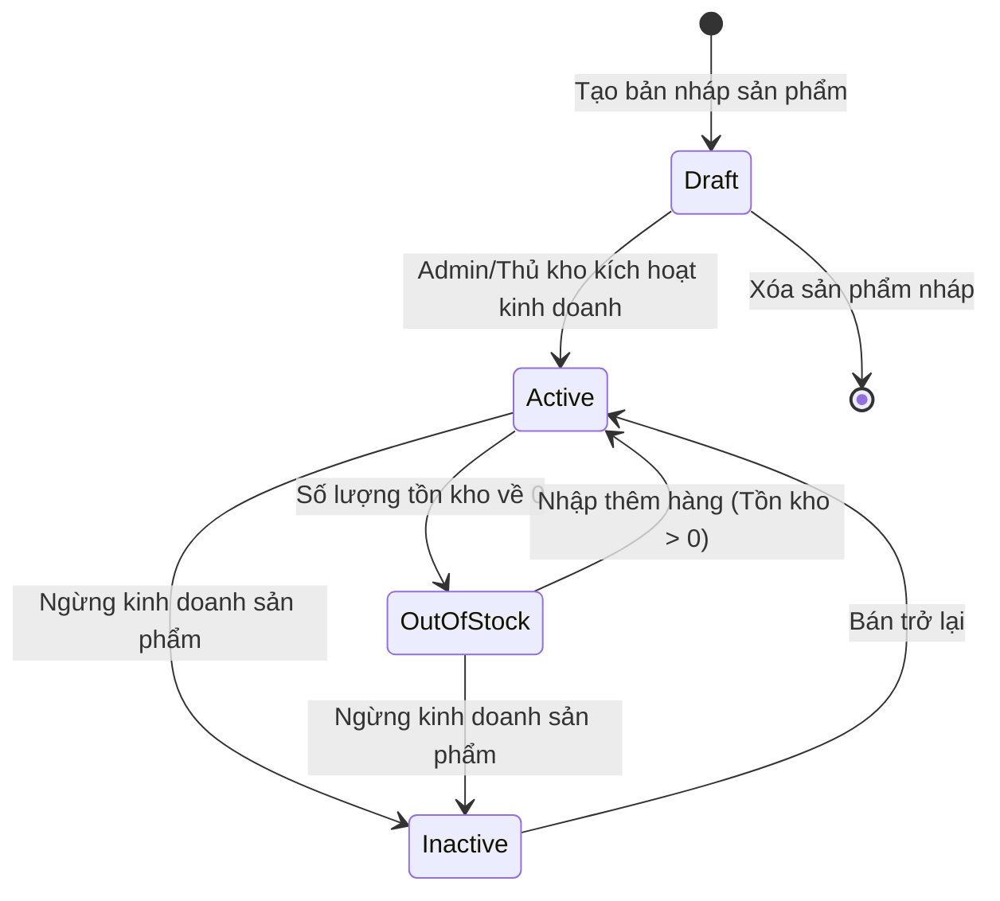
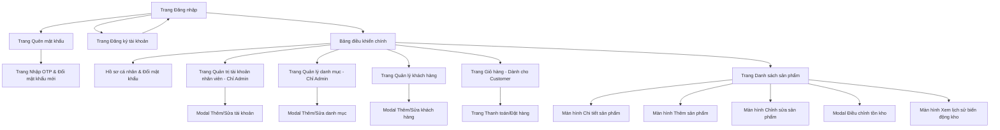

# TÀI LIỆU ĐẶC TẢ NGHIỆP VỤ
## Phân hệ: Xác thực, Phân quyền & Quản lý sản phẩm
**DỰ ÁN: QUẢN LÝ SẢN PHẨM**

* **Người thực hiện**: Phạm Thị Hằng
* **Ngày ban hành**: 10/07/2026
* **Mã tài liệu**: SRS_PRD_PRODUCT_01
* **Phiên bản**: 2.0

### THÔNG TIN KIỂM SOÁT TÀI LIỆU

| Trạng thái tài liệu | APPROVED |
| :--- | :--- |
| **Người viết** | Phạm Thị Hằng |
| **Người review** | Nguyễn Văn A (Tech Lead) |
| **Người phê duyệt** | Trần Thị B (Project Manager) |
| **QA** | Lê Văn C |
| **Phiên bản** | 2.0 |
| **Ngày phát hành** | 10/07/2026 |

### LỊCH SỬ THAY ĐỔI

| Ngày | Người thực hiện | Phiên bản | Nội dung |
| :--- | :--- | :--- | :--- |
| 08/05/2020 | Phạm Thị Hằng | 0.1 | Khởi tạo cấu trúc tài liệu nháp |
| 10/07/2026 | Phạm Thị Hằng | 1.0 | Làm lại tài liệu tập trung vào Quản lý sản phẩm |
| 10/07/2026 | Phạm Thị Hằng | 2.0 | Đồng bộ hóa và tích hợp chi tiết phân hệ Xác thực, Phân quyền & Quản lý tài khoản nhân viên theo file các thành phần |

### TÀI LIỆU LIÊN QUAN, THAM KHẢO

| Ngày | Tên tài liệu | Nguồn |
| :--- | :--- | :--- |
| 10/07/2026 | Tài liệu đặc tả yêu cầu khách hàng (URD) | Bộ phận Business Analyst (BA) |
| 10/07/2026 | Tài liệu thiết kế giao diện sản phẩm (Figma Mockup) | Bộ phận UI/UX Design |

---

## MỤC LỤC

1. [PHẦN 1: GIỚI THIỆU](#phần-1-giới-thiệu)
    - [1.1 Mục đích tài liệu](#11-mục-đích-tài-liệu)
    - [1.2 Phạm vi tài liệu](#12-phạm-vi-tài-liệu)
    - [1.3 Tổng quan ứng dụng](#13-tổng-quan-ứng-dụng)
    - [1.4 Thuật ngữ viết tắt](#14-thuật-ngữ-viết-tắt)
2. [PHẦN 2: YÊU CẦU TỔNG THỂ](#phần-2-yêu-cầu-tổng-thể)
    - [2.1 Sơ đồ quan hệ đối tượng (ERD)](#21-sơ-đồ-quan-hệ-đối-tượng-erd)
    - [2.2 Sơ đồ Use Case](#22-sơ-đồ-use-case)
    - [2.3 Sơ đồ luồng (Flowchart)](#23-sơ-đồ-luồng-flowchart)
    - [2.4 Sơ đồ chuyển trạng thái](#24-sơ-đồ-chuyển-trạng-thái)
    - [2.5 Phân quyền](#25-phân-quyền)
    - [2.6 Site Map](#26-site-map)
3. [PHẦN 3: CHỨC NĂNG CHI TIẾT](#phần-3-chức-năng-chi-tiết)
    - [3.1 UC01: Đăng nhập & Đăng xuất](#31-uc01-đăng-nhập--đăng-xuất)
    - [3.2 UC02: Khôi phục mật khẩu](#32-uc02-khôi-phục-mật-khẩu)
    - [3.3 UC03: Quản lý hồ sơ cá nhân & Đổi mật khẩu](#33-uc03-quản-lý-hồ-sơ-cá-nhân--đổi-mật-khẩu)
    - [3.4 UC04: Quản lý tài khoản nhân viên](#34-uc04-quản-lý-tài-khoản-nhân-viên)
    - [3.5 UC05: Quản lý danh mục sản phẩm](#35-uc05-quản-lý-danh-mục-sản-phẩm)
    - [3.6 UC06: Xem danh sách & Tìm kiếm sản phẩm](#36-uc06-xem-danh-sách--tìm-kiếm-sản-phẩm)
    - [3.7 UC07: Thêm mới & Cập nhật sản phẩm](#37-uc07-thêm-mới--cập-nhật-sản-phẩm)
    - [3.8 UC08: Điều chỉnh tồn kho (Kiểm kho)](#38-uc08-điều-chỉnh-tồn-kho-kiểm-kho)
    - [3.9 UC09: Xem lịch sử biến động kho (Stock Log)](#39-uc09-xem-lịch-sử-biến-động-kho-stock-log)
    - [3.10 UC10: Quản lý khách hàng](#310-uc10-quản-lý-khách-hàng)
    - [3.11 UC11: Tìm kiếm & Xem chi tiết sản phẩm (Khách hàng)](#311-uc11-tìm-kiếm--xem-chi-tiết-sản-phẩm-khách-hàng)
    - [3.12 UC12: Quản lý giỏ hàng](#312-uc12-quản-lý-giỏ-hàng)
    - [3.13 UC13: Đặt hàng & Mua sản phẩm](#313-uc13-đặt-hàng--mua-sản-phẩm)
    - [3.14 UC14: Đăng ký tài khoản](#314-uc14-đăng-ký-tài-khoản)
4. [PHẦN 4: CÁC COMPONENT, THÔNG BÁO, CẢNH BÁO](#phần-4-các-component-thông-báo-cảnh-báo)
5. [PHẦN 5: LINK ISSUE (JIRA)](#phần-5-link-issue-jira)

---

## PHẦN 1: GIỚI THIỆU

### 1.1 Mục đích tài liệu
Tài liệu này đặc tả chi tiết các yêu cầu nghiệp vụ, luồng xử lý dữ liệu, thiết kế giao diện sơ bộ và các ràng buộc kỹ thuật đối với hệ thống **Quản lý sản phẩm**. Tài liệu này làm căn cứ thống nhất giữa các bên liên quan bao gồm: Khách hàng (Product Owner), Đội ngũ Phát triển phần mềm (Developers) và Đội ngũ Kiểm thử chất lượng (QA/QC) để triển khai xây dựng và xác thực hệ thống.

### 1.2 Phạm vi tài liệu
Phạm vi tài liệu này bao gồm các chức năng cốt lõi được cấu thành từ 5 thành phần chính:
1. **Xác thực, phân quyền & Quản lý tài khoản nhân viên**: Đăng nhập, đăng xuất, khôi phục mật khẩu, quản lý thông tin cá nhân và quản trị danh sách nhân viên phục vụ vận hành.
2. **Quản lý danh mục**: Phân loại các nhóm sản phẩm trong hệ thống.
3. **Quản lý sản phẩm**: Xem danh sách, tìm kiếm, CRUD thông tin sản phẩm, điều chỉnh tồn kho và theo dõi lịch sử biến động kho hàng.
4. **Quản lý khách hàng**: Xem danh sách, tìm kiếm, thêm mới, cập nhật thông tin và ngừng hoạt động/xóa thông tin khách hàng.
5. **Giỏ hàng & Đặt hàng dành cho Khách hàng**: Khách hàng thực hiện tìm kiếm sản phẩm, quản lý giỏ hàng và đặt mua sản phẩm trên hệ thống.
Các chức năng bổ trợ khác như thanh toán trực tuyến qua cổng thanh toán thứ ba (Momo, VNPay...) và đối soát vận chuyển sẽ nằm ngoài phạm vi tài liệu này.

### 1.3 Tổng quan ứng dụng
Dự án **Quản lý sản phẩm** là một ứng dụng Web/App giúp doanh nghiệp số hóa quy trình quản trị thông tin sản phẩm, phân loại danh mục, giá bán và số lượng tồn kho. Quá trình vận hành được bảo mật thông qua cơ chế phân quyền dựa trên vai trò (RBAC), giúp phân định rõ nhiệm vụ của Quản trị viên, Thủ kho và Nhân viên bán hàng, đảm bảo tính chính xác và an toàn dữ liệu.

### 1.4 Thuật ngữ viết tắt

| STT | Từ viết tắt | Diễn giải |
| :--- | :--- | :--- |
| 1 | SKU | Stock Keeping Unit (Mã đơn vị lưu kho của sản phẩm) |
| 2 | ERD | Entity Relationship Diagram (Sơ đồ quan hệ thực thể) |
| 3 | CRUD | Create, Read, Update, Delete (Các thao tác Thêm, Đọc, Sửa, Xóa) |
| 4 | API | Application Programming Interface (Giao diện lập trình ứng dụng) |
| 5 | UI/UX | User Interface / User Experience (Giao diện / Trải nghiệm người dùng) |
| 6 | DB | Database (Cơ sở dữ liệu) |
| 7 | STATUS | Trạng thái hoạt động của sản phẩm, danh mục hoặc tài khoản |
| 8 | STOCK | Số lượng tồn kho hiện có của sản phẩm |
| 9 | RBAC | Role-Based Access Control (Kiểm soát truy cập dựa trên vai trò) |
| 10 | OTP | One-Time Password (Mật khẩu dùng một lần) |

---

## PHẦN 2: YÊU CẦU TỔNG THỂ

### 2.1 Sơ đồ quan hệ đối tượng (ERD)
Dưới đây là sơ đồ quan hệ thực thể (ERD) thể hiện cấu trúc cơ sở dữ liệu tích hợp cả phân hệ quản lý tài khoản/phân quyền và quản lý sản phẩm/kho hàng:

### 2.2 Sơ đồ Use Case
Sơ đồ Use Case thể hiện các tác nhân trong hệ thống và những chức năng mà họ có quyền thực hiện:

```mermaid
graph TD
    %% Actors
    Sales[Nhân viên bán hàng / Sales]
    Storekeeper[Thủ kho / Storekeeper]
    Admin[Quản trị viên / Admin]
    Cust[Khách mua hàng / Customer]
    Guest[Khách vãng lai / Guest]

    %% Use Cases
    UC01((UC01: Đăng nhập & Đăng xuất))
    UC02((UC02: Khôi phục mật khẩu))
    UC03((UC03: Quản lý hồ sơ & Đổi mật khẩu))
    UC04((UC04: Quản lý tài khoản nhân viên))
    UC05((UC05: Quản lý danh mục sản phẩm))
    UC06((UC06: Xem danh sách & Tìm kiếm sản phẩm))
    UC07((UC07: Thêm mới & Cập nhật sản phẩm))
    UC08((UC08: Điều chỉnh tồn kho / Kiểm kho))
    UC09((UC09: Xem lịch sử biến động kho))
    UC10((UC10: Quản lý khách hàng))
    UC11((UC11: Tìm kiếm & Xem chi tiết sản phẩm - Khách hàng))
    UC12((UC12: Quản lý giỏ hàng))
    UC13((UC13: Đặt hàng & Mua sản phẩm))
    UC14((UC14: Đăng ký tài khoản))

    %% Connections
    Guest --> UC11
    Guest --> UC14
    Sales --> UC01
    Sales --> UC02
    Sales --> UC03
    Sales --> UC06
    Sales --> UC10

    Storekeeper --> UC01
    Storekeeper --> UC02
    Storekeeper --> UC03
    Storekeeper --> UC06
    Storekeeper --> UC07
    Storekeeper --> UC08
    Storekeeper --> UC09

    Admin --> UC01
    Admin --> UC02
    Admin --> UC03
    Admin --> UC04
    Admin --> UC05
    Admin --> UC06
    Admin --> UC07
    Admin --> UC08
    Admin --> UC09
    Admin --> UC10

    Cust --> UC01
    Cust --> UC02
    Cust --> UC11
    Cust --> UC12
    Cust --> UC13
    Sales --> UC03
    Sales --> UC06
    Sales --> UC10

    Storekeeper --> UC01
    Storekeeper --> UC03
    Storekeeper --> UC06
    Storekeeper --> UC07
    Storekeeper --> UC08
    Storekeeper --> UC09

    Admin --> UC01
    Admin --> UC03
    Admin --> UC04
    Admin --> UC05
    Admin --> UC06
    Admin --> UC07
    Admin --> UC08
    Admin --> UC09
    Admin --> UC10

    Cust[Khách mua hàng / Customer] --> UC11
    Cust --> UC12
    Cust --> UC13
```

### 2.3 Sơ đồ luồng (Flowchart)

#### Luồng 1: Kiểm tra quyền truy cập (Authentication & Authorization Check)

#### Luồng 2: Thêm mới & cập nhật sản phẩm

#### Luồng 3: Điều chỉnh tồn kho (Kiểm kho)

#### Luồng 4: Đặt hàng & Mua sản phẩm

### 2.4 Sơ đồ chuyển trạng thái

#### Vòng đời hoạt động của Đơn hàng:

#### Vòng đời hoạt động của tài khoản người dùng:

#### Vòng đời hoạt động của sản phẩm:

### 2.5 Phân quyền

#### 2.5.1 Phân quyền chức năng
Ma trận phân quyền chi tiết cho tất cả các vai trò và chức năng:

| STT | Use Case | Bán hàng (Sales) | Thủ kho (Storekeeper) | Quản trị viên (Admin) | Khách hàng (Customer) | Mô tả |
| :--- | :--- | :---: | :---: | :---: | :---: | :--- |
| 1 | UC01: Đăng nhập & Đăng xuất | **Y** | **Y** | **Y** | **Y** | Truy cập hệ thống |
| 2 | UC02: Khôi phục mật khẩu | **Y** | **Y** | **Y** | **Y** | Lấy lại mật khẩu qua email |
| 3 | UC03: Hồ sơ & Đổi mật khẩu | **Y** | **Y** | **Y** | **Y** | Tự quản lý thông tin cá nhân |
| 4 | UC04: Quản lý nhân viên | **N** | **N** | **Y** | **N** | CRUD tài khoản nhân viên |
| 5 | UC05: Quản lý danh mục | **N** | **N** | **Y** | **N** | CRUD danh mục sản phẩm |
| 6 | UC06: Xem danh sách & Lọc | **Y** | **Y** | **Y** | **N** | Xem danh mục sản phẩm |
| 7 | UC07: Thêm mới & Sửa sản phẩm | **N** | **Y** | **Y** | **N** | Quản lý thông tin sản phẩm |
| 8 | UC08: Điều chỉnh tồn kho | **N** | **Y** | **Y** | **N** | Tăng/giảm tồn kho, kiểm kê kho |
| 9 | UC09: Xem lịch sử biến động kho| **N** | **Y** | **Y** | **N** | Xem lịch sử nhập xuất hàng |
| 10 | UC10: Quản lý khách hàng | **Y** | **N** | **Y** | **N** | CRUD thông tin khách hàng |
| 11 | UC11: Tìm kiếm & Xem chi tiết | **Y** | **Y** | **Y** | **Y** | Khách hàng tìm kiếm sản phẩm bán lẻ |
| 12 | UC12: Quản lý giỏ hàng | **N** | **N** | **N** | **Y** | Thêm, sửa, xóa giỏ hàng khách hàng |
| 13 | UC13: Đặt hàng & Mua sản phẩm| **N** | **N** | **N** | **Y** | Đặt đơn hàng mua sản phẩm |
| 14 | UC14: Đăng ký tài khoản | **N** | **N** | **N** | **Y** | Đăng ký tài khoản khách hàng mới |

*(Chú thích: **Y** = Yes (Có quyền); **N** = No (Không có quyền))*

#### 2.5.2 Phân quyền dữ liệu
- **Nhân viên bán hàng (Sales)**:
  - Chỉ được xem thông tin cơ bản của sản phẩm và tồn kho.
  - **Không được quyền xem giá vốn** (`cost_price`) của sản phẩm.
  - Được xem, tìm kiếm, thêm mới và cập nhật thông tin khách hàng. Không được quyền xóa khách hàng.
- **Thủ kho (Storekeeper)**:
  - Được xem giá vốn của sản phẩm phục vụ nghiệp vụ nhập xuất kho.
  - Chỉ được xem hồ sơ cá nhân và lịch sử hoạt động của chính mình.
- **Quản trị viên (Admin)**:
  - Xem và chỉnh sửa toàn bộ dữ liệu (bao gồm cả giá vốn, thông tin nhân viên, logs hệ thống).
  - Có quyền quản trị đầy đủ đối với dữ liệu khách hàng (xem, tìm kiếm, thêm mới, sửa, xóa).
- **Khách hàng (Customer)**:
  - Chỉ được xem thông tin bán lẻ của sản phẩm (`price`), tuyệt đối **không được nhìn thấy giá vốn** (`cost_price`).
  - Chỉ được xem, chỉnh sửa giỏ hàng và danh sách đơn hàng của chính mình.

### 2.6 Site Map
Sơ đồ mô tả luồng điều hướng giữa các trang:

---

## PHẦN 3: CHỨC NĂNG CHI TIẾT

### 3.1 UC01: Đăng nhập & Đăng xuất

#### 3.1.1 Đặc tả Use Case
- **Use Case ID**: **UC01**
- **Mô tả**: Cho phép người dùng đăng nhập bằng tên tài khoản và mật khẩu để truy cập hệ thống theo đúng vai trò, và đăng xuất khi hoàn thành công việc.
- **Tác nhân**: Sales, Storekeeper, Admin, Customer
- **Sự ưu tiên**: Cao
- **Trigger**: Truy cập hệ thống hoặc bấm nút "Đăng xuất".
- **Pre-Condition**: Tài khoản người dùng tồn tại và ở trạng thái `ACTIVE`.
- **Post-Condition**:
  - Hệ thống cấp JWT Token xác thực cho client khi đăng nhập thành công.
  - Điều hướng người dùng về trang Dashboard.
  - Xóa token xác thực khỏi Client khi đăng xuất.
- **Basic Flow (Đăng nhập)**:
  1. Người dùng nhập **Tên đăng nhập** (username) và **Mật khẩu** (password).
  2. Click nút **Đăng nhập**.
  3. Hệ thống validate:
     - Kiểm tra sự tồn tại của tài khoản.
     - Kiểm tra trạng thái tài khoản phải là `ACTIVE`.
     - So khớp hash mật khẩu (bằng bcrypt).
  4. Hệ thống cấp Token xác thực và lưu vào Session/Cookies của Client.
  5. Điều hướng người dùng vào trang Dashboard chính.
- **Basic Flow (Đăng xuất)**:
  1. Người dùng bấm nút **Đăng xuất** tại thanh công cụ hệ thống.
  2. Hệ thống thực hiện thu hồi JWT token ở phía Server và xóa token lưu tại Client.
  3. Hệ thống điều hướng người dùng về màn hình đăng nhập công cộng.
- **Exception Flow**:
  - **Exception 1 (Sai thông tin đăng nhập)**: Nhập sai username hoặc password -> Báo lỗi `ERR_AUTH_01` ("Tên đăng nhập hoặc mật khẩu không chính xác."). Tăng số lần nhập sai liên tiếp thêm 1 đơn vị.
  - **Exception 2 (Tài khoản bị khóa do nhập sai quá 5 lần)**: Nếu số lần nhập sai liên tiếp đạt 5 -> Cập nhật tài khoản sang trạng thái `LOCKED`. Báo lỗi `ERR_AUTH_03`.
- **Business Rules**: Mật khẩu truyền qua mạng bắt buộc dùng HTTPS. Trả số lần nhập sai về 0 sau khi đăng nhập thành công.

---

### 3.2 UC02: Khôi phục mật khẩu

#### 3.2.1 Đặc tả Use Case
- **Use Case ID**: **UC02**
- **Mô tả**: Cho phép người dùng lấy lại mật khẩu đăng nhập thông qua mã xác thực OTP gửi về địa chỉ Email đã đăng ký.
- **Tác nhân**: Sales, Storekeeper, Admin, Customer
- **Sự ưu tiên**: Trung bình
- **Trigger**: Click vào đường dẫn "Quên mật khẩu" tại màn hình Đăng nhập.
- **Pre-Condition**: Email nhập vào tồn tại trong hệ thống.
- **Post-Condition**: Mật khẩu mới được cập nhật trong CSDL và người dùng chuyển sang trang đăng nhập.
- **Basic Flow**:
  1. Người dùng chọn **Quên mật khẩu**.
  2. Nhập địa chỉ Email đăng ký và bấm nút **Gửi mã xác nhận**.
  3. Hệ thống kiểm tra email, tạo mã OTP gồm 6 chữ số ngẫu nhiên, lưu thời hạn hết hạn 10 phút, và gửi email chứa OTP tới người dùng.
  4. Người dùng nhập mã OTP, Mật khẩu mới và Xác nhận mật khẩu mới.
  5. Bấm nút **Đặt lại mật khẩu**.
  6. Hệ thống kiểm tra OTP chính xác, còn hạn và cập nhật mật khẩu mới (đã mã hóa) vào DB.
  7. Hiển thị thông báo thành công `MSG_SUCCESS_02` và chuyển hướng về màn hình đăng nhập.
- **Exception Flow**:
  - **Exception 1 (Email không tồn tại)**: Tại bước 3, báo lỗi `ERR_AUTH_04` ("Email không tồn tại trong hệ thống.").
  - **Exception 2 (OTP sai hoặc hết hạn)**: Tại bước 6, báo lỗi `ERR_AUTH_05`.
- **Business Rules**: Mỗi mã OTP chỉ có hiệu lực 1 lần. Chống spam: tối đa 3 lần gửi OTP trong vòng 15 phút cho một tài khoản.

---

### 3.3 UC03: Quản lý hồ sơ cá nhân & Đổi mật khẩu

#### 3.3.1 Đặc tả Use Case
- **Use Case ID**: **UC03**
- **Mô tả**: Cho phép người dùng đã đăng nhập tự xem, cập nhật thông tin cá nhân cơ bản và chủ động thực hiện đổi mật khẩu tài khoản.
- **Tác nhân**: Sales, Storekeeper, Admin
- **Sự ưu tiên**: Trung bình
- **Trigger**: Chọn mục "Hồ sơ cá nhân" từ Menu.
- **Pre-Condition**: Tài khoản đã đăng nhập thành công.
- **Post-Condition**: Cập nhật thông tin cá nhân và mật khẩu mới vào cơ sở dữ liệu.
- **Basic Flow (Cập nhật thông tin)**:
  1. Người dùng chọn mục **Hồ sơ cá nhân**.
  2. Hệ thống tải dữ liệu hiện tại lên màn hình. Các trường `username`, `email`, `role` hiển thị ở dạng chỉ đọc. Các trường `full_name`, `phone` cho phép chỉnh sửa.
  3. Người dùng sửa Họ tên, Số điện thoại và nhấn **Lưu thay đổi**.
  4. Hệ thống validate và lưu thay đổi vào DB, hiển thị `MSG_SUCCESS_03`.
- **Basic Flow (Đổi mật khẩu)**:
  1. Người dùng truy cập form **Đổi mật khẩu**.
  2. Nhập Mật khẩu hiện tại, Mật khẩu mới và Xác nhận mật khẩu mới.
  3. Bấm nút **Cập nhật mật khẩu**.
  4. Hệ thống kiểm tra mật khẩu hiện tại chính xác, mật khẩu mới đúng định dạng.
  5. Cập nhật mật khẩu mới vào DB và hiển thị thông báo thành công.

---

### 3.4 UC04: Quản lý tài khoản nhân viên

#### 3.4.1 Đặc tả Use Case
- **Use Case ID**: **UC04**
- **Mô tả**: Quản trị viên (Admin) quản lý danh sách nhân viên trong hệ thống (Xem danh sách, Thêm mới nhân viên, Sửa thông tin vai trò, Khóa/Mở khóa tài khoản).
- **Tác nhân**: Admin
- **Sự ưu tiên**: Cao
- **Trigger**: Admin chọn mục "Quản lý nhân viên" trên menu hệ thống.
- **Pre-Condition**: Tài khoản đăng nhập của tác nhân có vai trò là **ADMIN**.
- **Post-Condition**: Dữ liệu nhân viên được cập nhật tương ứng vào cơ sở dữ liệu.
- **Basic Flow (Thêm mới nhân viên)**:
  1. Admin bấm nút **Thêm tài khoản**.
  2. Điền thông tin: Username, Email, Họ tên, Số điện thoại, và chọn Vai trò (`STOREKEEPER` hoặc `SALES`).
  3. Nhấn **Lưu tài khoản**.
  4. Hệ thống kiểm tra trùng lặp Username/Email.
  5. Tạo tài khoản với mật khẩu tạm thời ngẫu nhiên, lưu trạng thái `ACTIVE`.
  6. Gửi Email mật khẩu tạm thời tới nhân viên, hiển thị `MSG_SUCCESS_04`.
- **Basic Flow (Khóa/Mở khóa tài khoản)**:
  1. Admin nhấn nút biểu tượng chiếc khóa tại dòng nhân viên trong bảng danh sách.
  2. Hệ thống chuyển đổi trạng thái của tài khoản: `ACTIVE` sang `LOCKED` (hoặc ngược lại) và hiển thị thông báo `MSG_SUCCESS_05`.
- **Exception Flow**:
  - **Exception 1 (Trùng Username hoặc Email)**: Báo lỗi trùng lặp dữ liệu `ERR_VAL_02`.
- **Business Rules**: Username và Email là duy nhất, không cho phép sửa đổi Username sau khi đã tạo.

---

### 3.5 UC05: Quản lý danh mục sản phẩm

#### 3.5.1 Đặc tả Use Case
- **Use Case ID**: **UC05**
- **Mô tả**: Quản trị viên thực hiện CRUD các danh mục nhằm phân loại sản phẩm trong kho.
- **Tác nhân**: Admin
- **Sự ưu tiên**: Trung bình
- **Trigger**: Chọn menu "Quản lý danh mục" từ Dashboard.
- **Pre-Condition**: Tài khoản đăng nhập của tác nhân có vai trò là **ADMIN**.
- **Post-Condition**: Danh mục được lưu mới, chỉnh sửa thông tin hoặc xóa khỏi cơ sở dữ liệu.
- **Basic Flow**:
  1. Admin truy cập màn hình **Quản lý danh mục**.
  2. Bấm nút **Thêm danh mục**.
  3. Nhập Tên danh mục, Mô tả danh mục, chọn Trạng thái hoạt động (`ACTIVE` hoặc `INACTIVE`).
  4. Bấm nút **Lưu danh mục**.
  5. Hệ thống kiểm tra tên danh mục duy nhất, lưu vào CSDL và thông báo `MSG_SUCCESS_06`.
- **Exception Flow**:
  - **Exception 1 (Trùng tên danh mục)**: Hệ thống báo lỗi trùng lặp tên danh mục.
  - **Exception 2 (Xóa danh mục đang có sản phẩm)**: Nếu Admin chọn xóa danh mục đang có sản phẩm hoạt động liên kết -> Hệ thống báo lỗi `ERR_VAL_04` ("Không thể xóa danh mục vì đang chứa sản phẩm liên kết.").

---

### 3.6 UC06: Xem danh sách & Tìm kiếm sản phẩm

#### 3.6.1 Đặc tả Use Case
- **Use Case ID**: **UC06**
- **Mô tả**: Cho phép người dùng tìm kiếm sản phẩm bằng tên hoặc mã SKU, kết hợp lọc theo danh mục, khoảng giá, trạng thái để theo dõi danh sách sản phẩm hiện có.
- **Tác nhân**: Sales, Storekeeper, Admin
- **Sự ưu tiên**: Cao
- **Trigger**: Tác nhân truy cập vào trang quản lý sản phẩm từ menu hệ thống.
- **Pre-Condition**: Người dùng đã đăng nhập vào hệ thống với vai trò hợp lệ.
- **Post-Condition**: Hệ thống hiển thị danh sách sản phẩm thỏa mãn điều kiện lọc kèm phân trang dữ liệu.
- **Basic Flow**:
  1. Người dùng chọn menu **Danh sách sản phẩm**.
  2. Hệ thống tải dữ liệu mặc định: Danh sách sản phẩm sắp xếp theo ngày tạo mới nhất, phân trang 10 sản phẩm/trang.
  3. Người dùng nhập thông tin tìm kiếm: Nhập từ khóa (tên hoặc mã SKU) và/hoặc chọn Danh mục, chọn Trạng thái, nhập Khoảng giá.
  4. Người dùng bấm nút **Tìm kiếm**.
  5. Hệ thống lọc dữ liệu từ DB và trả về danh sách sản phẩm phù hợp lên giao diện.
- **Business Rules**:
  - Không phân biệt chữ hoa/chữ thường đối với từ khóa SKU và Tên sản phẩm.
  - Nhân viên bán hàng (Sales) **không được nhìn thấy** trường giá vốn (`cost_price`) trên bảng danh sách.

---

### 3.7 UC07: Thêm mới & Cập nhật sản phẩm

#### 3.7.1 Đặc tả Use Case
- **Use Case ID**: **UC07**
- **Mô tả**: Thủ kho hoặc Admin có thể thêm mới một sản phẩm vào hệ thống hoặc chỉnh sửa các thông tin thuộc sản phẩm hiện tại.
- **Tác nhân**: Storekeeper, Admin
- **Sự ưu tiên**: Cao
- **Trigger**: Tác nhân click vào nút "Thêm sản phẩm" hoặc nút "Sửa" trên dòng sản phẩm tương ứng.
- **Pre-Condition**: Tài khoản có quyền quản trị hoặc thủ kho đã đăng nhập.
- **Post-Condition**: Thông tin sản phẩm mới được lưu hoặc thông tin cũ được cập nhật thành công vào cơ sở dữ liệu.
- **Basic Flow**:
  1. Người dùng bấm **Thêm sản phẩm** (hoặc **Sửa** sản phẩm).
  2. Hệ thống hiển thị form nhập liệu tương ứng.
  3. Người dùng nhập thông tin: Mã SKU, Tên sản phẩm, Danh mục (chọn từ dropdown), Giá bán, Giá vốn, Số lượng tồn kho ban đầu (chỉ khi thêm mới), Ảnh sản phẩm, Mô tả chi tiết.
  4. Người dùng click vào nút **Lưu**.
  5. Hệ thống kiểm tra hợp lệ của dữ liệu đầu vào.
  6. Hệ thống cập nhật DB và thông báo thành công `MSG_SUCCESS_07` (hoặc `MSG_SUCCESS_08`).
- **Alternative Flow (Tự sinh mã SKU)**: Nếu người dùng bỏ trống mã SKU khi tạo mới, hệ thống tự động tạo mã SKU theo cú pháp: `[MÃ_DANH_MỤC]-[SỐ_THỨ_TỰ_TỰ_TĂNG]`.
- **Exception Flow**:
  - **Exception 1 (Trùng mã SKU)**: Báo lỗi `ERR_VAL_01` ngay bên dưới trường SKU.
  - **Exception 2 (Giá bán nhỏ hơn giá vốn)**: Hiển thị cảnh báo lỗi `ERR_VAL_02`.
- **Business Rules**: Mã SKU không chứa khoảng trắng, giá bán/giá vốn lớn hơn hoặc bằng 0.

---

### 3.8 UC08: Điều chỉnh tồn kho (Kiểm kho)

#### 3.8.1 Đặc tả Use Case
- **Use Case ID**: **UC08**
- **Mô tả**: Cho phép thủ kho hoặc admin điều chỉnh số lượng hàng hóa thực tế đang có trong kho sau khi kiểm kho, xử lý hàng lỗi, hư hỏng hoặc nhập hàng bổ sung.
- **Tác nhân**: Storekeeper, Admin
- **Sự ưu tiên**: Cao
- **Trigger**: Tác nhân nhấn nút "Điều chỉnh kho" tại dòng sản phẩm trên màn hình danh sách.
- **Pre-Condition**: Sản phẩm đang ở trạng thái `ACTIVE` hoặc `OUT_OF_STOCK`.
- **Post-Condition**:
  - Số lượng tồn kho sản phẩm được cập nhật.
  - Hệ thống tạo mới 1 bản ghi lịch sử kho (`STOCK_LOG`).
- **Basic Flow**:
  1. Người dùng chọn chức năng **Điều chỉnh kho** cho sản phẩm.
  2. Hệ thống hiển thị Modal điều chỉnh kho gồm: Tên sản phẩm, Mã SKU, Số lượng tồn hiện tại.
  3. Người dùng chọn **Loại điều chỉnh**: Nhập thêm (+), Xuất kho (-), hoặc Nhập tồn thực tế.
  4. Người dùng nhập **Số lượng thay đổi** (chênh lệch) và điền **Lý do điều chỉnh** (bắt buộc).
  5. Người dùng click vào nút **Xác nhận**.
  6. Hệ thống thực hiện tính toán số lượng tồn mới và cập nhật vào CSDL.
  7. Hệ thống ghi một dòng log vào bảng `STOCK_LOG`.
  8. Hiển thị thông báo thành công `MSG_SUCCESS_09`.
- **Exception Flow**:
  - **Exception 1 (Số lượng tồn kho âm sau điều chỉnh)**: Báo lỗi `ERR_VAL_03` và không cho phép thực hiện.
- **Business Rules**: Số lượng chênh lệch/thực tế phải là số nguyên.

---

### 3.9 UC09: Xem lịch sử biến động kho (Stock Log)

#### 3.9.1 Đặc tả Use Case
- **Use Case ID**: **UC09**
- **Mô tả**: Cho phép thủ kho và admin xem lại toàn bộ lịch sử các giao dịch nhập kho, xuất kho và điều chỉnh tồn kho của các sản phẩm trên hệ thống để theo dõi biến động hàng hóa.
- **Tác nhân**: Storekeeper, Admin
- **Sự ưu tiên**: Trung bình
- **Trigger**: Chọn chức năng "Xem lịch sử kho" từ màn hình danh sách hoặc chi tiết sản phẩm.
- **Pre-Condition**: Đăng nhập tài khoản có quyền Storekeeper hoặc Admin.
- **Post-Condition**: Hệ thống kết xuất bảng dữ liệu ghi nhận lịch sử biến động kho theo thứ tự thời gian mới nhất.
- **Basic Flow**:
  1. Người dùng chọn menu **Lịch sử biến động kho** (hoặc click xem lịch sử riêng của một sản phẩm).
  2. Hệ thống hiển thị bộ lọc: Lọc theo khoảng thời gian (Từ ngày - Đến ngày), lọc theo sản phẩm (mã SKU/Tên), lọc theo Loại thay đổi (Nhập kho, Xuất kho, Điều chỉnh trực tiếp) và Người thực hiện.
  3. Người dùng chọn các bộ lọc và nhấn **Tìm kiếm**.
  4. Hệ thống tải dữ liệu từ bảng `STOCK_LOG` và hiển thị kết quả phân trang gồm các thông tin: Thời gian, SKU, Tên sản phẩm, Số lượng biến động (hiển thị dạng `+X` màu xanh hoặc `-X` màu đỏ), Số lượng tồn sau thay đổi, Loại điều chỉnh, Người thực hiện, và Lý do điều chỉnh.

---

### 3.10 UC10: Quản lý khách hàng

#### 3.10.1 Đặc tả Use Case
- **Use Case ID**: **UC10**
- **Mô tả**: Cho phép Nhân viên bán hàng (Sales) hoặc Quản trị viên (Admin) quản lý thông tin khách hàng trong hệ thống (Xem danh sách, tìm kiếm, thêm mới, cập nhật thông tin và xóa khách hàng).
- **Tác nhân**: Sales, Admin
- **Sự ưu tiên**: Cao
- **Trigger**: Tác nhân chọn mục "Quản lý khách hàng" trên menu hệ thống.
- **Pre-Condition**: Tài khoản đăng nhập của tác nhân có vai trò là **SALES** hoặc **ADMIN**.
- **Post-Condition**: Dữ liệu khách hàng được cập nhật tương ứng vào cơ sở dữ liệu.
- **Basic Flow (Thêm mới khách hàng)**:
  1. Tác nhân bấm nút **Thêm khách hàng**.
  2. Điền thông tin: Họ tên, Số điện thoại, Email (không bắt buộc), Địa chỉ và trạng thái (`ACTIVE` hoặc `INACTIVE`).
  3. Nhấn **Lưu khách hàng**.
  4. Hệ thống kiểm tra hợp lệ của dữ liệu đầu vào và kiểm tra trùng lặp Số điện thoại/Email.
  5. Tạo khách hàng mới với mã khách hàng tự sinh có định dạng `KH` kèm 4 chữ số tự tăng (ví dụ: `KH0001`).
  6. Lưu vào cơ sở dữ liệu và hiển thị thông báo thành công `MSG_SUCCESS_10`.
- **Basic Flow (Cập nhật thông tin khách hàng)**:
  1. Tác nhân bấm nút **Sửa** tại dòng thông tin khách hàng cần chỉnh sửa.
  2. Chỉnh sửa các trường thông tin cho phép: Họ tên, Số điện thoại, Email, Địa chỉ, Trạng thái.
  3. Nhấn **Lưu**.
  4. Hệ thống kiểm tra trùng lặp Số điện thoại/Email với các khách hàng khác, lưu thay đổi vào DB và hiển thị thông báo thành công `MSG_SUCCESS_11`.
- **Basic Flow (Xóa khách hàng - Chỉ Admin)**:
  1. Admin bấm nút **Xóa** khách hàng trong danh sách.
  2. Hệ thống kiểm tra ràng buộc và yêu cầu xác nhận xóa.
  3. Xóa bản ghi khách hàng khỏi DB và hiển thị thông báo thành công `MSG_SUCCESS_12`.
- **Exception Flow**:
  - **Exception 1 (Trùng Số điện thoại hoặc Email)**: Báo lỗi trùng lặp dữ liệu `ERR_VAL_06`.
  - **Exception 2 (Nhập thiếu trường bắt buộc hoặc định dạng không hợp lệ)**: Báo lỗi `ERR_VAL_07`.
- **Business Rules**: Họ tên và Số điện thoại là bắt buộc. Mã khách hàng (`customer_code`) là duy nhất và không cho phép thay đổi sau khi đã tạo. Chỉ ADMIN mới được thực hiện chức năng xóa khách hàng.

---

### 3.11 UC11: Tìm kiếm & Xem chi tiết sản phẩm (Khách hàng)

#### 3.11.1 Đặc tả Use Case
- **Use Case ID**: **UC11**
- **Mô tả**: Cho phép khách hàng tìm kiếm sản phẩm và xem chi tiết sản phẩm.
- **Tác nhân**: Customer
- **Sự ưu tiên**: Cao
- **Trigger**: Truy cập trang chủ hoặc trang sản phẩm của cửa hàng.
- **Pre-Condition**: Không có.
- **Post-Condition**: Hệ thống hiển thị danh sách sản phẩm hoặc chi tiết sản phẩm.
- **Basic Flow**:
  1. Người dùng truy cập trang danh sách sản phẩm.
  2. Hệ thống hiển thị danh sách sản phẩm bán lẻ.
  3. Người dùng tìm kiếm theo tên sản phẩm hoặc lọc theo danh mục, khoảng giá.
  4. Người dùng bấm chọn một sản phẩm để xem chi tiết (mô tả, hình ảnh, giá bán, tồn kho).
- **Business Rules**: Tuyệt đối ẩn trường giá vốn (`cost_price`) khỏi giao diện và API phản hồi cho khách hàng.

---

### 3.12 UC12: Quản lý giỏ hàng

#### 3.12.1 Đặc tả Use Case
- **Use Case ID**: **UC12**
- **Mô tả**: Cho phép khách hàng thêm sản phẩm vào giỏ, cập nhật số lượng hoặc xóa sản phẩm khỏi giỏ hàng.
- **Tác nhân**: Customer
- **Sự ưu tiên**: Cao
- **Trigger**: Nhấn nút "Thêm vào giỏ" tại trang danh sách/chi tiết sản phẩm hoặc truy cập trang giỏ hàng.
- **Pre-Condition**: Khách hàng đã đăng nhập tài khoản.
- **Post-Condition**: Giỏ hàng được cập nhật tương ứng trong DB.
- **Basic Flow (Thêm vào giỏ)**:
  1. Khách hàng nhấn **Thêm vào giỏ** tại một sản phẩm.
  2. Hệ thống kiểm tra: Nếu sản phẩm đã có trong giỏ, tăng số lượng thêm 1; nếu chưa có, thêm sản phẩm mới với số lượng 1.
  3. Hiển thị thông báo thành công `MSG_SUCCESS_13`.
- **Basic Flow (Cập nhật số lượng / Xóa khỏi giỏ)**:
  1. Khách hàng truy cập trang Giỏ hàng, thay đổi số lượng bằng ô nhập hoặc nút tăng/giảm (+/-), hoặc bấm nút **Xóa** sản phẩm.
  2. Hệ thống tính toán lại tổng tiền của giỏ hàng và cập nhật DB.

---

### 3.13 UC13: Đặt hàng & Mua sản phẩm

#### 3.13.1 Đặc tả Use Case
- **Use Case ID**: **UC13**
- **Mô tả**: Khách hàng đặt mua các sản phẩm đang có trong giỏ hàng.
- **Tác nhân**: Customer
- **Sự ưu tiên**: Cao
- **Trigger**: Khách hàng nhấn nút "Thanh toán" tại trang Giỏ hàng.
- **Pre-Condition**: Giỏ hàng có ít nhất một sản phẩm.
- **Post-Condition**: 
  - Đơn hàng được tạo thành công với trạng thái `PENDING`.
  - Số lượng tồn kho sản phẩm bị trừ tương ứng.
  - Ghi nhận logs biến động kho `STOCK_LOG` loại `EXPORT`.
  - Làm rỗng giỏ hàng.
- **Basic Flow**:
  1. Khách hàng truy cập trang Thanh toán, nhập Họ tên người nhận, Số điện thoại và Địa chỉ nhận hàng.
  2. Bấm nút **Đặt hàng**.
  3. Hệ thống bắt đầu Transaction:
     - Khóa và kiểm tra `stock_quantity` của từng sản phẩm trong giỏ hàng.
     - Nếu một sản phẩm không đủ hàng, rollback và báo lỗi `ERR_VAL_08`.
     - Tạo đơn hàng (`orders`) và chi tiết đơn hàng (`order_items`).
     - Trừ số lượng tồn kho `stock_quantity` trong bảng `PRODUCT`.
     - Ghi nhận logs `STOCK_LOG` loại `EXPORT` cho từng sản phẩm.
     - Làm rỗng giỏ hàng.
  4. Hiển thị thông báo thành công `MSG_SUCCESS_14`.
- **Exception Flow**:
  - **Exception 1 (Không đủ hàng trong kho)**: Hệ thống báo lỗi `ERR_VAL_08` kèm danh sách sản phẩm bị thiếu.
- **Business Rules**: Số điện thoại và Địa chỉ nhận hàng là bắt buộc. Hệ thống tự động sinh mã đơn hàng duy nhất theo định dạng `DH` + chuỗi thời gian/số tự tăng.

---

### 3.14 UC14: Đăng ký tài khoản

#### 3.14.1 Đặc tả Use Case
- **Use Case ID**: **UC14**
- **Mô tả**: Cho phép khách hàng mới (Khách vãng lai) tự đăng ký tài khoản trên hệ thống để thực hiện mua sắm, quản lý giỏ hàng và đặt hàng.
- **Tác nhân**: Guest (Khách vãng lai)
- **Sự ưu tiên**: Cao
- **Trigger**: Click vào nút/đường dẫn "Đăng ký tài khoản" tại màn hình Đăng nhập.
- **Pre-Condition**: Không có.
- **Post-Condition**: 
  - Tạo mới tài khoản trong bảng `users` với vai trò `CUSTOMER` và trạng thái `ACTIVE`.
  - Tạo mới hồ sơ khách hàng tương ứng trong bảng `customers` với trạng thái `ACTIVE`.
- **Basic Flow**:
  1. Người dùng chọn chức năng **Đăng ký** tại màn hình đăng nhập.
  2. Hệ thống hiển thị Form đăng ký gồm các thông tin: Tên đăng nhập (username), Mật khẩu (password), Nhập lại mật khẩu (confirm password), Email, Số điện thoại (phone), và Họ tên (full_name).
  3. Người dùng nhập đầy đủ thông tin và nhấn nút **Đăng ký**.
  4. Hệ thống thực hiện kiểm tra và validate thông tin đầu vào:
     - Các trường bắt buộc (username, password, confirm password, email, phone, full_name) không được để trống.
     - Định dạng Email và Số điện thoại phải hợp lệ.
     - Mật khẩu và Nhập lại mật khẩu phải khớp nhau.
     - Kiểm tra sự tồn tại của Tên đăng nhập, Email, Số điện thoại trong CSDL (bảng `users` và `customers`). Chúng phải là duy nhất.
  5. Hệ thống mã hóa mật khẩu bằng bcrypt.
  6. Hệ thống thực hiện lưu thông tin trong cùng một Database Transaction:
     - Thêm mới bản ghi vào bảng `users` (trạng thái `ACTIVE`).
     - Thêm mới liên kết vào bảng `user_roles` với vai trò `CUSTOMER`.
     - Thêm mới bản ghi khách hàng vào bảng `customers` (tự động tạo mã khách hàng dạng `KHxxxx` tự tăng).
  7. Hiển thị thông báo thành công `MSG_SUCCESS_15` và tự động chuyển hướng người dùng về trang Đăng nhập sau 2 giây.
- **Exception Flow**:
  - **Exception 1 (Thiếu trường bắt buộc hoặc thông tin sai định dạng)**: Báo lỗi `ERR_VAL_05`.
  - **Exception 2 (Mật khẩu xác nhận không khớp)**: Báo lỗi `ERR_VAL_09`.
  - **Exception 3 (Thông tin Username/Email/SĐT đã tồn tại)**: Báo lỗi `ERR_VAL_10`.
- **Business Rules**:
  - Username tối thiểu 5 ký tự, chỉ chứa chữ cái và chữ số, không chứa ký tự đặc biệt hay dấu cách.
  - Mật khẩu tối thiểu 8 ký tự, phải bao gồm ít nhất một chữ cái và một chữ số.
  - Số điện thoại phải tuân thủ định dạng số điện thoại Việt Nam (10 chữ số).

---

## PHẦN 4: CÁC COMPONENT, THÔNG BÁO, CẢNH BÁO

Dưới đây là danh sách chuẩn hóa toàn bộ các mã thông báo thành công, cảnh báo lỗi và các định dạng hiển thị UI (Component Badges):

### 4.1 Danh sách thông báo thành công (Success Messages)

| Mã thông báo | Nội dung thông báo | Vị trí hiển thị | Mô tả |
| :--- | :--- | :--- | :--- |
| `MSG_SUCCESS_01` | "Đăng nhập thành công! Đang chuyển hướng..." | Trang đăng nhập | Toast màu xanh lá, chuyển hướng sau 1.5 giây. |
| `MSG_SUCCESS_02` | "Đặt lại mật khẩu thành công! Vui lòng đăng nhập bằng mật khẩu mới." | Trang quên mật khẩu | Popup thông báo, có nút chuyển về trang đăng nhập. |
| `MSG_SUCCESS_03` | "Cập nhật thông tin hồ sơ cá nhân thành công." | Hồ sơ cá nhân | Toast thành công ở phía góc trên bên phải màn hình. |
| `MSG_SUCCESS_04` | "Tạo mới tài khoản nhân viên thành công!" | Modal tạo tài khoản | Đóng modal và reload danh sách nhân viên. |
| `MSG_SUCCESS_05` | "Cập nhật trạng thái tài khoản nhân viên thành công." | Bảng danh sách nhân viên | Toast nhỏ góc màn hình khi toggle trạng thái. |
| `MSG_SUCCESS_06` | "Tạo mới/Cập nhật danh mục sản phẩm thành công!" | Modal tạo danh mục | Đóng modal và reload danh sách danh mục sản phẩm. |
| `MSG_SUCCESS_07` | "Thêm mới sản phẩm thành công!" | Form thêm sản phẩm | Toast màu xanh lá, chuyển hướng về trang danh sách sản phẩm. |
| `MSG_SUCCESS_08` | "Cập nhật thông tin sản phẩm thành công." | Form sửa sản phẩm | Toast màu xanh lá góc trên bên phải màn hình. |
| `MSG_SUCCESS_09` | "Điều chỉnh tồn kho sản phẩm thành công." | Modal điều chỉnh kho | Đóng modal, hiển thị Toast thành công và reload bảng số lượng. |
| `MSG_SUCCESS_10` | "Thêm mới khách hàng thành công!" | Modal tạo khách hàng | Đóng modal và reload danh sách khách hàng. |
| `MSG_SUCCESS_11` | "Cập nhật thông tin khách hàng thành công." | Modal sửa khách hàng | Đóng modal và reload danh sách khách hàng. |
| `MSG_SUCCESS_12` | "Xóa khách hàng thành công!" | Bảng danh sách khách hàng | Reload danh sách khách hàng sau khi xóa. |
| `MSG_SUCCESS_13` | "Đã cập nhật giỏ hàng thành công!" | Trang sản phẩm / Giỏ hàng | Toast nhỏ hiển thị khi thêm/sửa giỏ hàng. |
| `MSG_SUCCESS_14` | "Đặt hàng thành công! Đang xử lý đơn hàng..." | Trang thanh toán | Chuyển hướng khách hàng về trang lịch sử đơn hàng. |
| `MSG_SUCCESS_15` | "Đăng ký tài khoản thành công! Đang chuyển hướng..." | Trang đăng ký | Toast màu xanh lá, tự động chuyển hướng về trang Đăng nhập sau 2 giây. |

### 4.2 Danh sách cảnh báo lỗi (Error Messages)

| Mã lỗi | Nội dung hiển thị | Nguyên nhân xảy ra |
| :--- | :--- | :--- |
| `ERR_AUTH_01` | "Tên đăng nhập hoặc mật khẩu không chính xác. Vui lòng thử lại." | Nhập sai mật khẩu hoặc tên đăng nhập không tồn tại. |
| `ERR_AUTH_02` | "Tài khoản đã bị khóa. Vui lòng liên hệ quản trị viên để được hỗ trợ." | Tài khoản đang có trạng thái `LOCKED` khi đăng nhập. |
| `ERR_AUTH_03` | "Tài khoản của bạn đã bị khóa tạm thời do nhập sai mật khẩu quá 5 lần." | Nhập sai mật khẩu liên tiếp đạt giới hạn bảo mật (5 lần). |
| `ERR_AUTH_04` | "Email không tồn tại trong hệ thống. Vui lòng kiểm tra lại." | Nhập email khôi phục mật khẩu không khớp với bất kỳ tài khoản nào. |
| `ERR_AUTH_05` | "Mã OTP không chính xác hoặc đã hết hiệu lực. Vui lòng thử lại." | Nhập sai mã OTP khôi phục mật khẩu hoặc nhập sau thời gian 10 phút. |
| `ERR_VAL_01` | "Mã SKU đã tồn tại trên hệ thống. Vui lòng nhập mã khác." | Nhập trùng mã SKU của một sản phẩm khác đã có trong CSDL. |
| `ERR_VAL_02` | "Giá bán không được nhỏ hơn giá vốn. Vui lòng kiểm tra lại." | Nhập Giá bán nhỏ hơn Giá vốn trên form thêm mới/chỉnh sửa sản phẩm. |
| `ERR_VAL_03` | "Số lượng tồn kho sau khi điều chỉnh không thể nhỏ hơn 0." | Thực hiện xuất kho với số lượng lớn hơn số lượng tồn kho hiện tại. |
| `ERR_VAL_04` | "Không thể xóa danh mục vì đang chứa sản phẩm liên kết." | Cố gắng xóa danh mục khi đang có sản phẩm thuộc danh mục đó. |
| `ERR_VAL_05` | "Thông tin nhập vào không đúng định dạng hoặc để trống trường bắt buộc." | Không nhập Tên sản phẩm hoặc Giá bán hoặc nhập sai kiểu định dạng số. |
| `ERR_VAL_06` | "Số điện thoại hoặc Email đã tồn tại trên hệ thống. Vui lòng kiểm tra lại." | Trùng lặp thông tin số điện thoại hoặc email khi tạo mới/cập nhật thông tin khách hàng. |
| `ERR_VAL_07` | "Thông tin khách hàng không hợp lệ. Họ tên và Số điện thoại là bắt buộc." | Không nhập Họ tên/SĐT khách hàng hoặc nhập sai kiểu định dạng số điện thoại/email. |
| `ERR_VAL_08` | "Đặt hàng thất bại. Một số sản phẩm trong giỏ hàng đã hết hoặc không đủ số lượng tồn kho." | Không đủ số lượng tồn kho của sản phẩm khi tiến hành đặt hàng. |
| `ERR_VAL_09` | "Mật khẩu nhập lại không trùng khớp. Vui lòng kiểm tra lại." | Nhập lại mật khẩu không trùng khớp với mật khẩu mới. |
| `ERR_VAL_10` | "Tên đăng nhập, Email hoặc Số điện thoại đã được đăng ký trên hệ thống." | Trùng lặp thông tin khi đăng ký tài khoản khách hàng mới. |
| `ERR_SYS_01` | "Lỗi kết nối máy chủ. Vui lòng kiểm tra mạng và thử lại sau." | Lỗi hệ thống mất kết nối mạng hoặc lỗi server nội bộ (500 Internal Error). |

### 4.3 Định nghĩa định dạng UI Component (Status Badges)

Các trạng thái sản phẩm, danh mục và tài khoản phải được định dạng đồng bộ theo màu sắc quy định sau:

- **Trạng thái tài khoản:**
  - `ACTIVE` (Hoạt động): Badge viền tròn, nền xanh lá cây nhạt (`#E6F4EA`), chữ màu xanh lá cây đậm (`#137333`).
  - `LOCKED` (Đang khóa): Badge viền tròn, nền hồng nhạt (`#FCE8E6`), chữ màu đỏ đậm (`#C5221F`).
  - `DELETED` (Đã xóa): Badge viền tròn, nền xám nhạt (`#F1F3F4`), chữ màu đen/xám đậm (`#3C4043`).
- **Trạng thái sản phẩm:**
  - `ACTIVE` (Đang bán): Badge viền tròn, nền xanh lá cây nhạt (`#E6F4EA`), chữ màu xanh lá cây đậm (`#137333`).
  - `OUT_OF_STOCK` (Hết hàng): Badge viền tròn, nền cam nhạt (`#FEF7E0`), chữ màu cam/vàng đậm (`#B06000`).
  - `INACTIVE` (Ngừng bán): Badge viền tròn, nền hồng nhạt (`#FCE8E6`), chữ màu đỏ đậm (`#C5221F`).
- **Trạng thái danh mục:**
  - `ACTIVE` (Hoạt động): Badge viền tròn, nền xanh lá cây nhạt (`#E6F4EA`), chữ màu xanh lá cây đậm (`#137333`).
  - `INACTIVE` (Ngừng hoạt động): Badge viền tròn, nền xám nhạt (`#F1F3F4`), chữ màu đen/xám đậm (`#3C4043`).
- **Trạng thái khách hàng:**
  - `ACTIVE` (Hoạt động): Badge viền tròn, nền xanh lá cây nhạt (`#E6F4EA`), chữ màu xanh lá cây đậm (`#137333`).
  - `INACTIVE` (Ngừng hoạt động): Badge viền tròn, nền xám nhạt (`#F1F3F4`), chữ màu đen/xám đậm (`#3C4043`).
- **Trạng thái đơn hàng:**
  - `PENDING` (Chờ xử lý): Badge viền tròn, nền cam nhạt (`#FEF7E0`), chữ màu cam/vàng đậm (`#B06000`).
  - `CONFIRMED` (Đã xác nhận): Badge viền tròn, nền xanh dương nhạt (`#E8F0FE`), chữ màu xanh dương đậm (`#1A73E8`).
  - `SHIPPING` (Đang giao hàng): Badge viền tròn, nền tím nhạt (`#F3E8FD`), chữ màu tím đậm (`#8AB4F8`).
  - `COMPLETED` (Đã hoàn thành): Badge viền tròn, nền xanh lá cây nhạt (`#E6F4EA`), chữ màu xanh lá cây đậm (`#137333`).
  - `CANCELLED` (Đã hủy): Badge viền tròn, nền hồng nhạt (`#FCE8E6`), chữ màu đỏ đậm (`#C5221F`).

---

## PHẦN 5: LINK ISSUE (JIRA)

Dưới đây là danh sách liên kết mã nhiệm vụ trên hệ thống quản lý Jira của dự án nhằm theo dõi tiến độ phát triển:

### 5.1 Phân hệ Xác thực & Quản lý tài khoản nhân viên
- [PRD-ACCOUNT-01](https://jira.company.com/browse/PRD-ACCOUNT-01): Thiết kế CSDL (ERD) & Cấu hình Phân quyền RBAC.
- [PRD-ACCOUNT-02](https://jira.company.com/browse/PRD-ACCOUNT-02): Phát triển chức năng Xác thực Đăng nhập & Đăng xuất (UC01).
- [PRD-ACCOUNT-03](https://jira.company.com/browse/PRD-ACCOUNT-03): Phát triển tính năng Quên mật khẩu & Gửi Email mã OTP (UC02).
- [PRD-ACCOUNT-04](https://jira.company.com/browse/PRD-ACCOUNT-04): Xây dựng giao diện & API Cập nhật hồ sơ cá nhân và đổi mật khẩu (UC03).
- [PRD-ACCOUNT-05](https://jira.company.com/browse/PRD-ACCOUNT-05): Phát triển bảng quản lý và bộ lọc danh sách nhân viên (UC04 - Admin).
- [PRD-ACCOUNT-06](https://jira.company.com/browse/PRD-ACCOUNT-06): Phát triển tính năng Thêm mới, Sửa đổi và Khóa/Mở khóa tài khoản (UC04 - Admin).
- [PRD-ACCOUNT-07](https://jira.company.com/browse/PRD-ACCOUNT-07): Kiểm thử tích hợp (Integration Test) & Kiểm tra lỗ hổng bảo mật của phân hệ Quản lý tài khoản.
- [PRD-ACCOUNT-08](https://jira.company.com/browse/PRD-ACCOUNT-08): Phát triển API & Giao diện Đăng ký tài khoản dành cho Khách hàng (UC14).

### 5.2 Phân hệ Quản lý sản phẩm
- [PRD-PRODUCT-01](https://jira.company.com/browse/PRD-PRODUCT-01): Thiết kế cấu trúc cơ sở dữ liệu (ERD) cho các bảng sản phẩm, danh mục và lịch sử biến động tồn kho.
- [PRD-PRODUCT-02](https://jira.company.com/browse/PRD-PRODUCT-02): Phát triển API & Giao diện Xem danh sách, tìm kiếm và lọc sản phẩm (UC06).
- [PRD-PRODUCT-03](https://jira.company.com/browse/PRD-PRODUCT-03): Xây dựng màn hình xem chi tiết thông tin và thông số sản phẩm.
- [PRD-PRODUCT-04](https://jira.company.com/browse/PRD-PRODUCT-04): Xây dựng màn hình và API Thêm mới, cập nhật thông tin sản phẩm (UC07).
- [PRD-PRODUCT-05](https://jira.company.com/browse/PRD-PRODUCT-05): Phát triển tính năng Điều chỉnh tồn kho & Ghi nhận lịch sử kho STOCK_LOG (UC08).
- [PRD-PRODUCT-06](https://jira.company.com/browse/PRD-PRODUCT-06): Phát triển phân hệ Quản lý danh mục sản phẩm (UC05).
- [PRD-PRODUCT-07](https://jira.company.com/browse/PRD-PRODUCT-07): Phát triển màn hình và API Xem lịch sử biến động kho hàng (UC09).
- [PRD-PRODUCT-08](https://jira.company.com/browse/PRD-PRODUCT-08): Kiểm thử tích hợp (Integration Test) & Kiểm thử các luồng nghiệp vụ Quản lý sản phẩm.

### 5.3 Phân hệ Quản lý khách hàng
- [PRD-CUSTOMER-01](https://jira.company.com/browse/PRD-CUSTOMER-01): Thiết kế CSDL (ERD) & Đặc tả chức năng Quản lý khách hàng.
- [PRD-CUSTOMER-02](https://jira.company.com/browse/PRD-CUSTOMER-02): Phát triển API & Giao diện Xem danh sách, tìm kiếm và lọc khách hàng (UC10).
- [PRD-CUSTOMER-03](https://jira.company.com/browse/PRD-CUSTOMER-03): Xây dựng màn hình và API Thêm mới, cập nhật thông tin khách hàng.
- [PRD-CUSTOMER-04](https://jira.company.com/browse/PRD-CUSTOMER-04): Phát triển tính năng Xóa/Ngừng hoạt động khách hàng (Chỉ Admin).
- [PRD-CUSTOMER-05](https://jira.company.com/browse/PRD-CUSTOMER-05): Kiểm thử tích hợp (Integration Test) & Kiểm thử các luồng nghiệp vụ Quản lý khách hàng.

### 5.4 Phân hệ Mua hàng & Giỏ hàng
- [PRD-ORDER-01](https://jira.company.com/browse/PRD-ORDER-01): Thiết kế CSDL các bảng CART, CART_ITEM, ORDER, ORDER_ITEM.
- [PRD-ORDER-02](https://jira.company.com/browse/PRD-ORDER-02): Phát triển API & Giao diện tìm kiếm, xem danh sách sản phẩm bán lẻ (UC11).
- [PRD-ORDER-03](https://jira.company.com/browse/PRD-ORDER-03): Phát triển API & Giao diện Quản lý giỏ hàng (UC12).
- [PRD-ORDER-04](https://jira.company.com/browse/PRD-ORDER-04): Phát triển API & Giao diện Đặt hàng, điền thông tin giao hàng (UC13).
- [PRD-ORDER-05](https://jira.company.com/browse/PRD-ORDER-05): Phát triển nghiệp vụ kiểm tra tồn kho, trừ kho và đồng bộ `STOCK_LOG` trong Transaction.
- [PRD-ORDER-06](https://jira.company.com/browse/PRD-ORDER-06): Phát triển màn hình danh sách đơn hàng và quản lý trạng thái đơn hàng (Admin/Sales).
