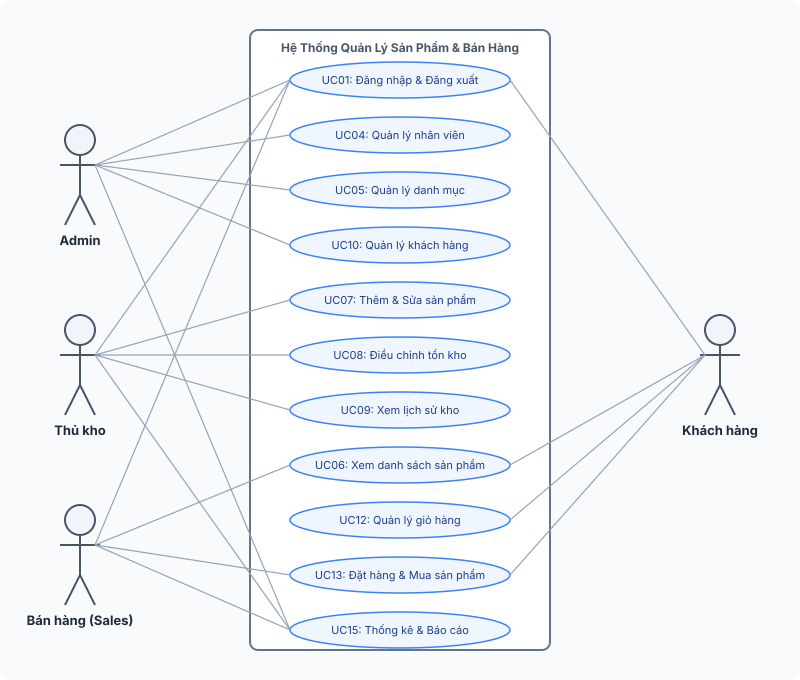
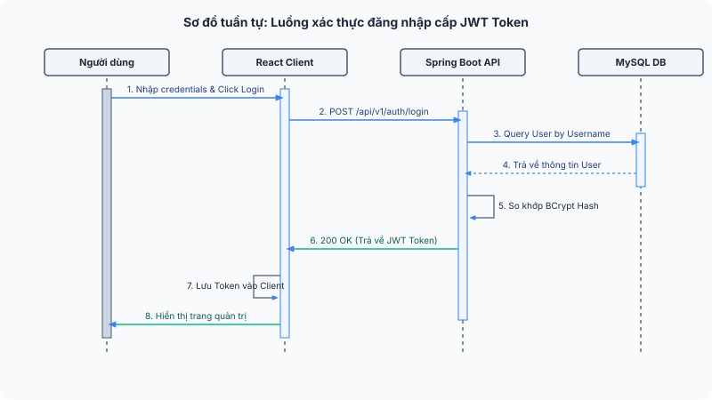
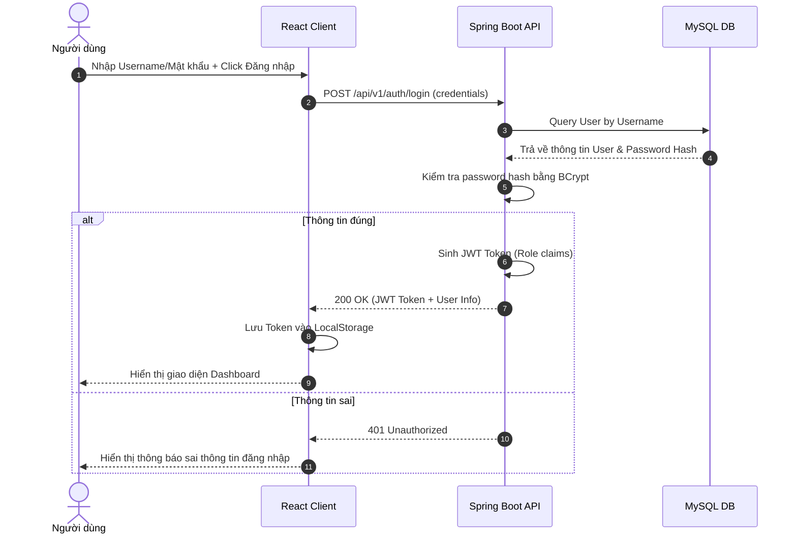
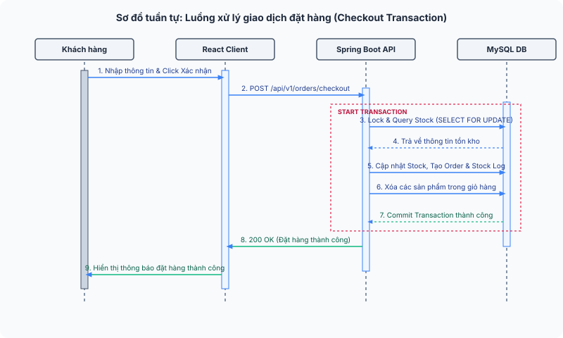
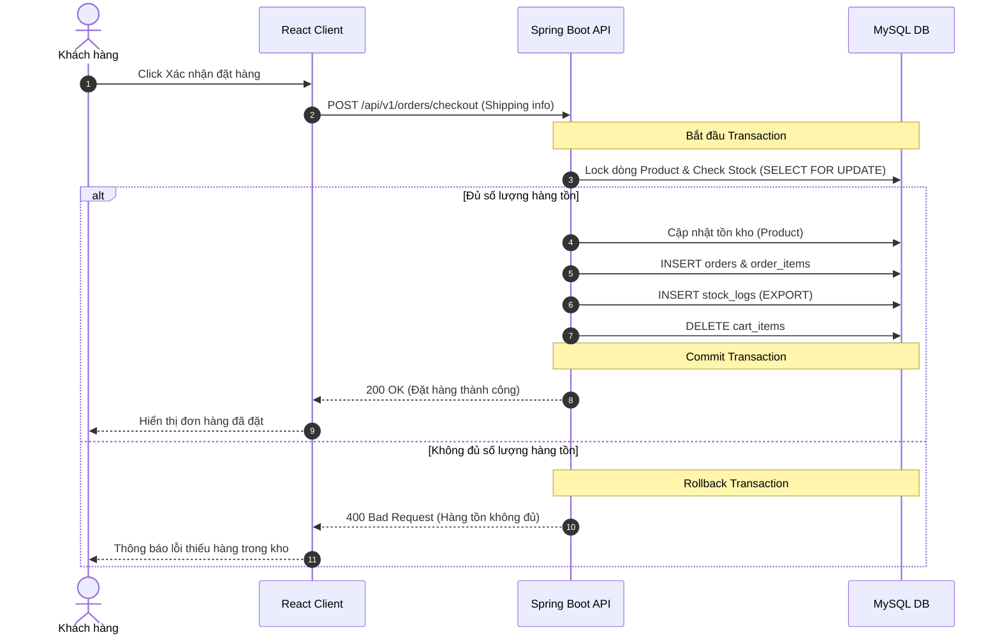
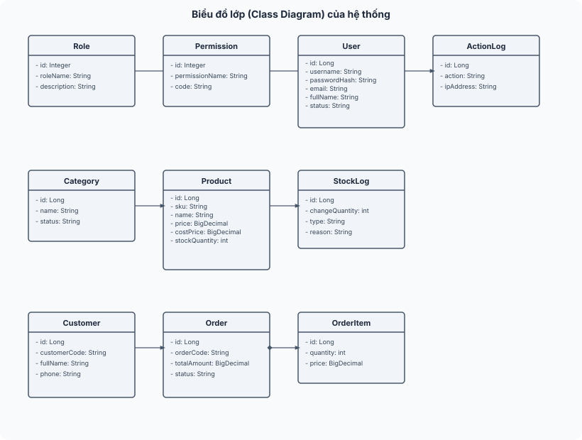
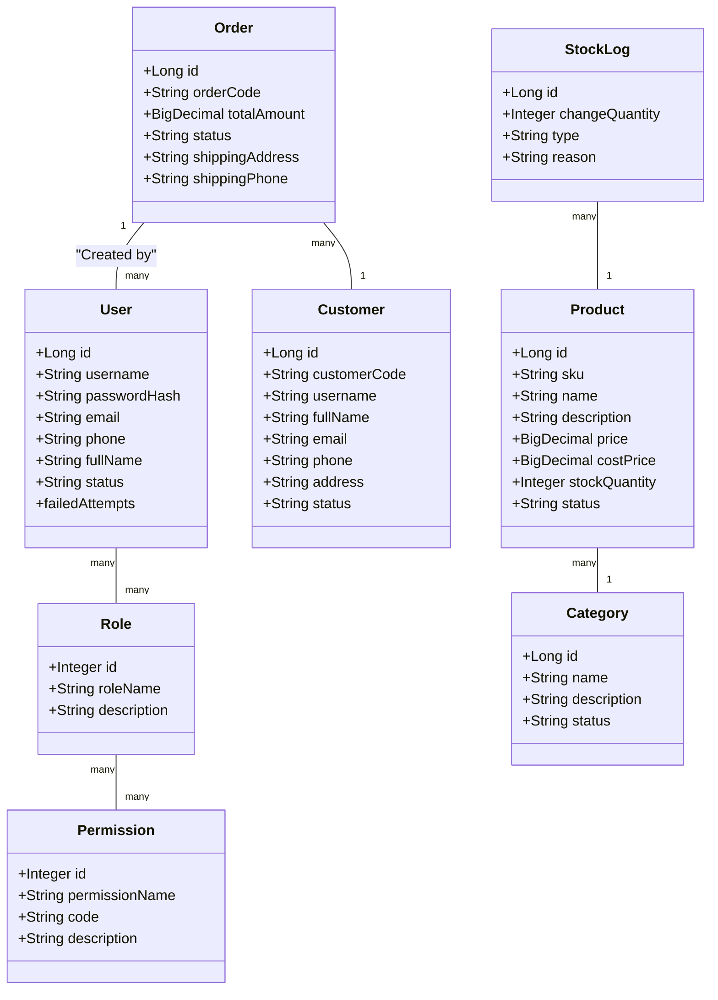

# BÁO CÁO BÀI TẬP LỚN

### **HỌC VIỆN CÔNG NGHỆ BƯU CHÍNH VIỄN THÔNG**

## **BÁO CÁO BÀI TẬP LỚN**

**TÊN ĐỀ TÀI:**

**_Xây dựng hệ thống quản lý sản phẩm và bán hàng_**

**Giảng viên hướng dẫn**: Thầy Bùi Thanh Hải  
**Đơn vị công tác**: Khoa Công nghệ thông tin - Học viện Công nghệ Bưu chính Viễn thông  
**Chương trình đào tạo**: hệ từ xa liên kết doanh nghiệp rikkei sort  
**Lớp**: cntt3  
**Sinh viên thực hiện**: Đỗ Gia Hưng  
**Mã sinh viên**: B24DTCN232  

**Hà Nội – 2026**

---

#### **NHẬN XÉT CỦA GIẢNG VIÊN HƯỚNG DẪN**

Nhận xét: 
..................................................................................................................................................................................
..................................................................................................................................................................................
..................................................................................................................................................................................
..................................................................................................................................................................................

**Xác nhận của giảng viên hướng dẫn**

---

#### **LỜI CẢM ƠN**

Lời đầu tiên, nhóm chúng em xin gửi lời cảm ơn chân thành và sâu sắc đến Học viện Công nghệ Bưu chính Viễn thông, đặc biệt là **Khoa Công nghệ thông tin**, vì đã tạo ra một môi trường học tập hiện đại, năng động và giàu tính thực tiễn. Nhờ có sự đầu tư, quan tâm sát sao trong công tác giảng dạy, nghiên cứu khoa học và định hướng nghề nghiệp, chúng em đã có cơ hội được rèn luyện kiến thức chuyên môn, phát triển kỹ năng tư duy độc lập, làm việc nhóm, cũng như tích lũy nhiều kinh nghiệm quý báu trong suốt quá trình học tập và trưởng thành tại Học viện.

Đồ án này là một học phần có ý nghĩa đặc biệt quan trọng, đánh dấu bước chuyển mình từ lý thuyết học đường sang thực tiễn phát triển phần mềm. Trong khuôn khổ môn học này, chúng em không chỉ được tiếp cận và giải quyết một bài toán thực tiễn có tính ứng dụng cao, mà còn có cơ hội nghiên cứu, tìm hiểu các công nghệ hiện đại, tiếp cận xu hướng phát triển của ngành công nghệ thông tin, từ đó trang bị hành trang vững chắc cho sự nghiệp sau này.

Chúng em xin bày tỏ lòng biết ơn sâu sắc đến **Thầy Bùi Thanh Hải** – giảng viên hướng dẫn – người đã luôn tận tâm, nhiệt huyết trong việc truyền đạt kiến thức, định hướng nghiên cứu và không ngừng hỗ trợ, động viên chúng em trong suốt quá trình thực hiện đồ án. Những góp ý chuyên môn quý báu cùng sự đồng hành của thầy là nguồn động lực to lớn giúp nhóm chúng em vượt qua những khó khăn, thử thách để hoàn thành tốt đồ án này.

Dù đã rất nỗ lực, chắc chắn trong quá trình thực hiện và trình bày đồ án sẽ không tránh khỏi những thiếu sót. Chúng em rất mong nhận được sự góp ý của quý thầy cô để sản phẩm được hoàn thiện hơn và chúng em có thể tiếp tục cải thiện bản thân trong chặng đường sắp tới.

Một lần nữa, chúng em xin chân thành cảm ơn!

**Sinh viên thực hiện**  
Đỗ Gia Hưng

---

#### **LỜI CAM ĐOAN**

Chúng em xin cam đoan rằng, đề tài **“_Xây dựng hệ thống quản lý sản phẩm và bán hàng cho sinh viên - giảng viên Khoa Công nghệ thông tin - Học viện Công nghệ Bưu chính Viễn thông_”** là công trình nghiên cứu của nhóm chúng em, được thực hiện dưới sự hướng dẫn của Thầy Bùi Thanh Hải. Tất cả các nội dung trong đồ án đều do nhóm chúng em tự nghiên cứu, triển khai và hoàn thành. Các số liệu, kết quả trong đồ án là hoàn toàn chính xác, không sao chép, không vi phạm quyền sở hữu trí tuệ của bất kỳ tổ chức hay cá nhân nào.

Chúng em xin cam đoan rằng, mọi tài liệu tham khảo trong đồ án đều được trích dẫn đầy đủ, rõ ràng, tuân thủ đúng các quy định về bản quyền và trích dẫn nguồn. Đồ án này chưa từng được nộp và xét duyệt ở bất kỳ trường nào dưới bất kỳ hình thức nào.

Nếu có bất kỳ sai sót nào, chúng em xin chịu trách nhiệm và cam kết sửa chữa kịp thời.

**Sinh viên thực hiện**  
Đỗ Gia Hưng

---

#### **MỤC LỤC**

| Nội dung | Trang |
| :--- | :--- |
| LỜI CẢM ƠN | 1 |
| LỜI CAM ĐOAN | 2 |
| MỤC LỤC | 3 |
| LỜI MỞ ĐẦU | 5 |
| **CHƯƠNG 1: TỔNG QUAN VỀ HỆ THỐNG QUẢN LÝ SẢN PHẨM VÀ BÁN HÀNG** | 6 |
| 1.1. Giới thiệu | 6 |
| 1.1.1. Khái niệm và mục đích | 6 |
| 1.1.2. Quy trình hoạt động của hệ thống | 6 |
| 1.2. Thực trạng quản lý sản phẩm và bán hàng tại các doanh nghiệp | 7 |
| 1.3. Các thành phần chính của hệ thống | 7 |
| 1.4. Bài toán quản lý sản phẩm và bán hàng | 8 |
| 1.4.1. Phát biểu bài toán | 8 |
| 1.4.2. Mục tiêu hệ thống | 9 |
| 1.4.3. Phạm vi chức năng | 9 |
| 1.4.4. Giải pháp công nghệ sử dụng | 9 |
| 1.5. Kế hoạch thực hiện dự án | 10 |
| **CHƯƠNG 2: PHÂN TÍCH VÀ THIẾT KẾ HỆ THỐNG** | 11 |
| 2.1. Sơ đồ ca sử dụng (Use Case) | 11 |
| 2.2. Đặc tả các ca sử dụng chính | 12 |
| 2.3. Mô hình hóa hoạt động (Sequence Diagrams) | 15 |
| 2.4. Biểu đồ lớp của hệ thống (Class Diagram) | 16 |
| 2.5. Thiết kế cơ sở dữ liệu (ERD và Chi tiết bảng) | 17 |
| **CHƯƠNG 3: CÀI ĐẶT VÀ KIỂM THỬ HỆ THỐNG** | 22 |
| 3.1. Cơ chế bảo mật và phân quyền (JWT & BCrypt) | 22 |
| 3.2. Xây dựng giao diện Frontend (React) | 23 |
| 3.3. Xây dựng Backend API (Spring Boot) | 25 |
| 3.4. Thử nghiệm và kiểm thử hệ thống (Postman Testing) | 27 |
| **KẾT LUẬN VÀ HƯỚNG PHÁT TRIỂN** | 30 |
| **TÀI LIỆU THAM KHẢO** | 31 |

---

#### **LỜI MỞ ĐẦU**

Trong thời đại số hóa hiện nay, việc ứng dụng công nghệ thông tin vào quản lý kinh doanh không còn là lựa chọn mà đã trở thành yêu cầu bắt buộc đối với mọi doanh nghiệp. Quản lý sản phẩm và bán hàng là một trong những nghiệp vụ cốt lõi, quyết định sự thành bại của doanh nghiệp bán lẻ và phân phối. Việc quản lý thủ công trước đây bằng sổ sách hoặc Excel bộc lộ nhiều điểm hạn chế lớn như dễ thất thoát dữ liệu, không kiểm soát được số lượng tồn kho theo thời gian thực, thiếu tính bảo mật và chậm trễ trong báo cáo doanh thu.

Nhằm giải quyết những thách thức đó, đồ án **“Xây dựng hệ thống quản lý sản phẩm và bán hàng”** được triển khai để mang lại một công cụ số hóa toàn diện, đồng bộ hóa dữ liệu trực tuyến giữa các bộ phận: Quản trị (Admin), Thủ kho (Storekeeper) và Nhân viên bán hàng (Sales), đồng thời cung cấp cổng mua sắm trực tuyến thân thiện cho Khách hàng (Customer).

Hệ thống được phát triển dựa trên kiến trúc phân tách rõ ràng giữa **Frontend (React)** và **Backend (Spring Boot)**, giao tiếp qua **RESTful API** và lưu trữ trên cơ sở dữ liệu quan hệ **MySQL**. Điều này giúp tối ưu hóa hiệu năng, tăng khả năng bảo mật thông qua cơ chế phân quyền dựa trên vai trò (RBAC) và JWT Token.

---

### **CHƯƠNG 1: TỔNG QUAN VỀ HỆ THỐNG QUẢN LÝ SẢN PHẨM VÀ BÁN HÀNG**

#### **1.1. Giới thiệu**

##### **1.1.1. Khái niệm và mục đích**
Hệ thống quản lý sản phẩm và bán hàng là giải pháp phần mềm tích hợp hỗ trợ doanh nghiệp quản lý thông tin danh mục, sản phẩm, số lượng tồn kho, quy trình đặt hàng và doanh số bán hàng. Mục đích cốt lõi là tối ưu hóa quy trình luân chuyển hàng hóa, đảm bảo tính toàn vẹn dữ liệu, tăng năng suất lao động của nhân viên và nâng cao trải nghiệm mua sắm của khách hàng.

##### **1.1.2. Quy trình hoạt động của hệ thống**
1. **Quản trị hệ thống**: Admin thiết lập các danh mục sản phẩm, quản lý tài khoản nhân viên và phân quyền vai trò hoạt động.
2. **Quản lý kho hàng**: Thủ kho nhập hàng, theo dõi biến động tồn kho và điều chỉnh số lượng thông qua cơ chế ghi nhận nhật ký kho chi tiết (`stock_logs`).
3. **Bán hàng và Giao dịch**: Nhân viên bán hàng tạo và cập nhật đơn hàng; khách hàng trực tuyến tự do duyệt sản phẩm, thêm vào giỏ hàng và tiến hành thanh toán đặt hàng. Khi đơn hàng được hoàn tất, hệ thống tự động trừ kho sản phẩm tương ứng.
4. **Báo cáo và thống kê**: Hệ thống tổng hợp dữ liệu doanh thu, sản phẩm bán chạy, cơ cấu tồn kho để hiển thị lên Dashboard của từng vai trò nhân sự.

#### **1.2. Thực trạng quản lý sản phẩm và bán hàng tại các doanh nghiệp**
Tại nhiều doanh nghiệp vừa và nhỏ ở Việt Nam, việc quản lý kho và đơn hàng vẫn mang tính thủ công. Khi quy mô mặt hàng và lượng giao dịch tăng lên, phương pháp này bộc lộ các vấn đề:
- **Thất thoát hàng hóa**: Không đối soát được số lượng thực tế với sổ sách.
- **Trì trệ trong bán hàng**: Nhân viên bán hàng không biết chính xác sản phẩm còn hay hết trong kho để tư vấn cho khách.
- **Thiếu tính bảo mật**: Nhân viên dễ dàng xem được giá vốn nhạy cảm hoặc chỉnh sửa số liệu mà không có nhật ký ghi vết (`action_logs`).
Do đó, việc xây dựng một hệ thống số hóa tập trung, phân quyền chặt chẽ là giải pháp tối ưu và vô cùng cấp thiết.

#### **1.3. Các thành phần chính của hệ thống**
Hệ thống được thiết kế bao gồm 6 thành phần chính:
1. **Thành phần Xác thực & Phân quyền (RBAC)**: Đăng ký, đăng nhập, khôi phục mật khẩu, phân chia vai trò rõ ràng giữa Admin, Storekeeper, Sales và Customer.
2. **Thành phần Quản lý Danh mục**: Quản trị danh mục phân loại sản phẩm.
3. **Thành phần Quản lý Sản phẩm & Tồn kho**: Theo dõi thông tin sản phẩm, quản lý giá bán, giá vốn, điều chỉnh kho và ghi nhận lịch sử biến động.
4. **Thành phần Quản lý Khách hàng**: Quản lý thông tin liên hệ và lịch sử giao dịch của khách hàng.
5. **Thành phần Mua hàng & Giỏ hàng**: Dành cho khách hàng lựa chọn sản phẩm, quản lý giỏ hàng trực tuyến và tiến hành checkout đặt hàng.
6. **Thành phần Dashboard & Thống kê**: Báo cáo trực quan bằng biểu đồ về doanh thu, tồn kho và hiệu suất bán hàng.

#### **1.4. Bài toán quản lý sản phẩm và bán hàng**

##### **1.4.1. Phát biểu bài toán**
Xây dựng một ứng dụng web phục vụ việc quản lý nội bộ doanh nghiệp và bán lẻ trực tuyến cho khách hàng. Hệ thống phải đảm bảo:
- Bảo mật thông tin: Nhân viên bán hàng không được xem giá vốn sản phẩm.
- An toàn giao dịch: Khi khách hàng đặt hàng, phải sử dụng cơ chế khóa dữ liệu (transaction locking) để tránh tình trạng bán quá số lượng tồn thực tế.
- Ghi vết lịch sử: Mọi thao tác kiểm kho, đổi vai trò hoặc khóa tài khoản đều phải lưu lại lịch sử chi tiết.

##### **1.4.2. Mục tiêu hệ thống**
- Tự động hóa 100% quy trình trừ kho và cập nhật trạng thái đơn hàng.
- Đảm bảo thời gian phản hồi API dưới 500ms đối với các tác vụ thông thường.
- Giao diện hiện đại, dễ thao tác trên cả máy tính và thiết bị di động.

##### **1.4.3. Phạm vi chức năng**
Hệ thống tập trung vào các chức năng quản lý danh mục, sản phẩm, điều chỉnh kho, quản trị tài khoản nội bộ và chức năng e-commerce cơ bản cho khách hàng (không bao gồm thanh toán trực tuyến qua bên thứ ba và giao vận phức tạp).

##### **1.4.4. Giải pháp công nghệ sử dụng**
- **Frontend**: **React** (với Vite), sử dụng Axios làm HTTP Client, quản lý định tuyến bằng React Router DOM và giao diện hiện đại với Lucide Icons.
- **Backend**: **Spring Boot** (Java), tích hợp Spring Security, Spring Data JPA và JWT để bảo mật API.
- **Cơ sở dữ liệu**: **MySQL** (lưu trữ quan hệ).

#### **1.5. Kế hoạch thực hiện dự án**

| STT | Giai đoạn/Công việc | Mô tả chi tiết | Thời gian bắt đầu | Thời gian kết thúc | Người phụ trách |
| :--- | :--- | :--- | :--- | :--- | :--- |
| 1 | Khởi động & Nghiên cứu | Xác định mục tiêu, lập đặc tả yêu cầu (SRS) | 05/05/2026 | 12/05/2026 | Đỗ Gia Hưng |
| 2 | Thiết kế hệ thống | Thiết kế cơ sở dữ liệu (ERD), thiết kế giao diện | 13/05/2026 | 25/05/2026 | Đỗ Gia Hưng |
| 3 | Phát triển Backend | Lập trình các API (Authentication, CRUD, Cart, Checkout, Dashboard) | 26/05/2026 | 20/06/2026 | Đỗ Gia Hưng |
| 4 | Phát triển Frontend | Xây dựng giao diện React và tích hợp gọi API | 21/06/2026 | 15/07/2026 | Đỗ Gia Hưng |
| 5 | Tích hợp & Kiểm thử | Kiểm thử API bằng Postman, tối ưu hóa transaction | 16/07/2026 | 28/07/2026 | Đỗ Gia Hưng |
| 6 | Nghiệm thu & Báo cáo | Viết tài liệu báo cáo lớn và nghiệm thu | 29/07/2026 | 04/08/2026 | Đỗ Gia Hưng |

---

### **CHƯƠNG 2: PHÂN TÍCH VÀ THIẾT KẾ HỆ THỐNG**

#### **2.1. Sơ đồ ca sử dụng (Use Case)**
Hệ thống tương tác với 4 tác nhân chính: **Admin**, **Storekeeper** (Thủ kho), **Sales** (Bán hàng) và **Customer** (Khách hàng). 



*(Mã nguồn sơ đồ Mermaid để kết xuất động):*

```mermaid
usecaseDiagram
    actor Admin
    actor Storekeeper
    actor Sales
    actor Customer

    Admin --> (UC01: Đăng nhập & Đăng xuất)
    Admin --> (UC04: Quản lý nhân viên)
    Admin --> (UC05: Quản lý danh mục)
    Admin --> (UC10: Quản lý khách hàng)
    Admin --> (UC15: Thống kê & Báo cáo Admin)

    Storekeeper --> (UC01: Đăng nhập & Đăng xuất)
    Storekeeper --> (UC07: Thêm mới & Cập nhật sản phẩm)
    Storekeeper --> (UC08: Điều chỉnh tồn kho)
    Storekeeper --> (UC09: Xem lịch sử biến động kho)
    Storekeeper --> (UC15: Thống kê & Báo cáo Thủ kho)

    Sales --> (UC01: Đăng nhập & Đăng xuất)
    Sales --> (UC06: Xem danh sách sản phẩm)
    Sales --> (UC13: Quản lý đơn hàng)
    Sales --> (UC15: Thống kê doanh số cá nhân)

    Customer --> (UC14: Đăng ký tài khoản)
    Customer --> (UC11: Xem chi tiết sản phẩm)
    Customer --> (UC12: Quản lý giỏ hàng)
    Customer --> (UC13: Đặt hàng & Mua sản phẩm)
```

#### **2.2. Đặc tả các ca sử dụng chính**

##### **2.2.1. UC01: Đăng nhập**
* **Tác nhân**: Admin, Storekeeper, Sales, Customer.
* **Mục đích**: Xác thực người dùng và cấp JWT Token truy cập hệ thống.
* **Luồng chính**:
  1. Người dùng nhập Username và Password, nhấn nút "Đăng nhập".
  2. Hệ thống mã hóa thông tin gửi lên Backend API.
  3. Backend xác thực thông tin đăng nhập trong cơ sở dữ liệu.
  4. Nếu khớp, hệ thống tạo JWT Token (chứa vai trò) gửi về Client để lưu trữ và chuyển hướng người dùng đến giao diện tương ứng.

##### **2.2.2. UC08: Điều chỉnh tồn kho (Kiểm kho)**
* **Tác nhân**: Storekeeper (Thủ kho).
* **Mục đích**: Điều chỉnh tăng hoặc giảm số lượng tồn thực tế của sản phẩm.
* **Luồng chính**:
  1. Thủ kho chọn sản phẩm cần điều chỉnh từ danh sách.
  2. Hệ thống hiển thị số lượng tồn hiện tại.
  3. Thủ kho chọn loại điều chỉnh (Nhập kho/Xuất kho/Kiểm kho), nhập số lượng thay đổi và lý do điều chỉnh.
  4. Hệ thống validate số lượng tồn mới không âm.
  5. Backend thực hiện cập nhật `stock_quantity` của sản phẩm và ghi nhận chi tiết vào bảng `stock_logs`.

##### **2.2.3. UC13: Đặt hàng & Mua sản phẩm**
* **Tác nhân**: Customer (Khách hàng).
* **Mục đích**: Khách hàng thanh toán giỏ hàng trực tuyến và tạo đơn hàng.
* **Luồng chính**:
  1. Khách hàng xem giỏ hàng và nhấn "Tiến hành đặt hàng".
  2. Khách hàng nhập địa chỉ nhận hàng và số điện thoại, nhấn "Xác nhận đặt hàng".
  3. Hệ thống bắt đầu một Transaction: khóa các dòng sản phẩm trong DB để kiểm tra tồn kho.
  4. Nếu số lượng đủ, hệ thống tạo bản ghi `orders` và `order_items`, giảm `stock_quantity` của sản phẩm, ghi log xuất kho vào `stock_logs` và xóa giỏ hàng của khách.
  5. Transaction được commit và hệ thống hiển thị thông báo đặt hàng thành công.

##### **2.2.4. UC15: Thống kê & Báo cáo**
* **Tác nhân**: Admin, Storekeeper, Sales.
* **Mục đích**: Hiển thị báo cáo trực quan phù hợp với vai trò của nhân sự.
* **Luồng chính**:
  1. Người dùng truy cập trang chủ hệ thống.
  2. Hệ thống gửi yêu cầu API thống kê tương ứng với vai trò lấy từ JWT Token.
  3. Admin nhận dữ liệu: tổng doanh thu, doanh số nhân viên sales, biểu đồ top sản phẩm.
  4. Thủ kho nhận dữ liệu: tồn kho thấp, sản phẩm hết hàng, số lượt nhập xuất trong ngày.
  5. Nhân viên sales nhận dữ liệu: doanh số cá nhân đạt được trong tháng.

#### **2.3. Mô hình hóa hoạt động (Sequence Diagrams)**

##### **2.3.1. Luồng xác thực đăng nhập cấp JWT Token**


*(Mã nguồn sơ đồ Mermaid để kết xuất động):*



##### **2.3.2. Luồng thực hiện đặt hàng (Checkout Transaction)**


*(Mã nguồn sơ đồ Mermaid để kết xuất động):*



#### **2.4. Biểu đồ lớp của hệ thống (Class Diagram)**


*(Mã nguồn sơ đồ Mermaid để kết xuất động):*



#### **2.5. Thiết kế cơ sở dữ liệu (ERD và Chi tiết bảng)**

##### **2.5.1. Bảng `users` (Nhân viên hệ thống)**
| STT | Tên trường | Kiểu dữ liệu | Khóa | Chú thích |
| :--- | :--- | :--- | :--- | :--- |
| 1 | `id` | BIGINT | PK | Mã tự tăng định danh nhân viên |
| 2 | `username` | VARCHAR(50) | Unique | Tên tài khoản đăng nhập |
| 3 | `password_hash` | VARCHAR(255) | | Mật khẩu đã mã hóa bằng BCrypt |
| 4 | `email` | VARCHAR(100) | Unique | Email liên hệ nhân viên |
| 5 | `phone` | VARCHAR(20) | | Số điện thoại |
| 6 | `full_name` | VARCHAR(100) | | Họ và tên đầy đủ |
| 7 | `status` | VARCHAR(20) | | ACTIVE, LOCKED, DELETED |
| 8 | `created_at` | TIMESTAMP | | Thời gian khởi tạo tài khoản |

##### **2.5.2. Bảng `products` (Sản phẩm lưu kho)**
| STT | Tên trường | Kiểu dữ liệu | Khóa | Chú thích |
| :--- | :--- | :--- | :--- | :--- |
| 1 | `id` | BIGINT | PK | Mã tự tăng định danh sản phẩm |
| 2 | `sku` | VARCHAR(50) | Unique | Mã đơn vị lưu kho duy nhất |
| 3 | `name` | VARCHAR(150) | | Tên sản phẩm |
| 4 | `description` | TEXT | | Mô tả chi tiết sản phẩm |
| 5 | `price` | DECIMAL(15,2) | | Giá bán lẻ ra thị trường |
| 6 | `cost_price` | DECIMAL(15,2) | | Giá vốn nhập hàng (Ẩn với Sales) |
| 7 | `stock_quantity` | INT | | Số lượng tồn kho thực tế |
| 8 | `status` | VARCHAR(20) | | ACTIVE, OUT_OF_STOCK, INACTIVE |
| 9 | `category_id` | BIGINT | FK | Liên kết tới bảng categories |

##### **2.5.3. Bảng `orders` (Đơn đặt hàng)**
| STT | Tên trường | Kiểu dữ liệu | Khóa | Chú thích |
| :--- | :--- | :--- | :--- | :--- |
| 1 | `id` | BIGINT | PK | Mã tự tăng định danh đơn hàng |
| 2 | `customer_id` | BIGINT | FK | Liên kết tới bảng khách hàng |
| 3 | `order_code` | VARCHAR(50) | Unique | Mã đơn hàng sinh tự động |
| 4 | `total_amount` | DECIMAL(15,2) | | Tổng giá trị đơn hàng |
| 5 | `status` | VARCHAR(30) | | PENDING, CONFIRMED, COMPLETED... |
| 6 | `shipping_address` | VARCHAR(255) | | Địa chỉ nhận hàng |
| 7 | `shipping_phone` | VARCHAR(20) | | Số điện thoại nhận hàng |

##### **2.5.4. Bảng `stock_logs` (Nhật ký biến động tồn kho)**
| STT | Tên trường | Kiểu dữ liệu | Khóa | Chú thích |
| :--- | :--- | :--- | :--- | :--- |
| 1 | `id` | BIGINT | PK | Mã tự tăng nhật ký kho |
| 2 | `product_id` | BIGINT | FK | Liên kết tới bảng sản phẩm |
| 3 | `change_quantity` | INT | | Số lượng thay đổi (dạng + hoặc -) |
| 4 | `type` | VARCHAR(20) | | IMPORT, EXPORT, ADJUST |
| 5 | `reason` | TEXT | | Lý do biến động (Nhập hàng/Đặt hàng...) |
| 6 | `created_by` | BIGINT | FK | Người thực hiện (Liên kết users) |

---

### **CHƯƠNG 3: CÀI ĐẶT VÀ KIỂM THỬ HỆ THỐNG**

#### **3.1. Cơ chế bảo mật và phân quyền (JWT & BCrypt)**
Hệ thống sử dụng mô hình stateless kết hợp giữa **Spring Security** và **JWT**:
1. Mật khẩu lưu trữ trong bảng `users` được băm bằng thuật toán **BCrypt** mạnh mẽ để tránh bị khai thác nếu cơ sở dữ liệu bị rò rỉ.
2. Khi đăng nhập thành công, hệ thống cấp phát một chuỗi token mã hóa chứa thông tin định danh và vai trò (claims). Token này được đính kèm vào phần Header (`Authorization: Bearer <Token>`) của các yêu cầu gửi từ phía React Client.
3. Bộ lọc `JwtAuthenticationFilter` ở Backend chặn mọi request gửi lên để kiểm tra chữ ký token và thiết lập ngữ cảnh bảo mật (`SecurityContextHolder`). Các phân quyền được kiểm tra trực tiếp qua Annotation `@PreAuthorize` trên các Controller (Ví dụ: `@PreAuthorize("hasRole('ADMIN')")`).

#### **3.2. Xây dựng giao diện Frontend (React)**
Ứng dụng frontend được xây dựng bằng React mang lại giao diện mượt mà dạng Single Page Application (SPA):
* **DashboardLayout**: Cung cấp sidebar định tuyến cho nhân sự và top navbar cho khách hàng. Tự động hiển thị các tab chức năng dựa trên quyền của tài khoản đang đăng nhập.
* **CategoryManagement**: Hiển thị danh sách danh mục sản phẩm dưới dạng bảng động, hỗ trợ tìm kiếm và thêm/sửa danh mục thông qua modal.
* **ProductManagement**: Hiển thị danh sách sản phẩm với giá bán, phân trang và bộ lọc. Cho phép Admin/Thủ kho cập nhật sản phẩm và điều chỉnh tồn kho qua pop-up kiểm kho. Giá vốn `cost_price` được kiểm tra chặt chẽ, ẩn hoàn toàn đối với vai trò `SALES`.
* **Cart & Checkout**: Cho phép khách hàng thêm sản phẩm vào giỏ, điều chỉnh số lượng thông qua input và tiến hành xác nhận đặt hàng đơn giản.

#### **3.3. Xây dựng Backend API (Spring Boot)**
Backend sử dụng mô hình kiến trúc phân lớp chuẩn:
- **Entity**: Khai báo các thực thể Java ánh xạ sang bảng MySQL qua Hibernate (JPA).
- **Repository**: Sử dụng Spring Data JPA để kế thừa các thao tác CRUD cơ bản và xây dựng các truy vấn SQL/JPQL tùy biến cho Dashboard.
- **Service & ServiceImpl**: Xử lý logic nghiệp vụ và quản lý giao dịch dữ liệu. Lớp `OrderServiceImpl` sử dụng Transaction `@Transactional` để thực hiện khóa dữ liệu trong quá trình đặt hàng, đảm bảo tính nhất quán của số lượng tồn kho.
- **Controller**: Tiếp nhận request, validate dữ liệu đầu vào và trả về JSON chuẩn cho Client.

#### **3.4. Thử nghiệm và kiểm thử hệ thống (Postman Testing)**
Quá trình thử nghiệm được tiến hành bằng cách gửi các yêu cầu giả lập qua **Postman** để kiểm tra tính toàn vẹn của các API:

##### **3.4.1. Thử nghiệm Đăng nhập (Xác thực JWT)**
* **Yêu cầu**: POST `http://localhost:8080/api/v1/auth/login`
* **JSON gửi đi**:
  ```json
  {
    "username": "admin",
    "password": "AdminPassword123"
  }
  ```
* **Kết quả phản hồi**: Trả về mã lỗi `200 OK` đi kèm với thông tin người dùng và mã JWT Token.
* **Hình ảnh minh họa kết quả**:
  *(Hình 3.1. Phản hồi API đăng nhập thành công trả về JWT Token định dạng JSON)*

##### **3.4.2. Thử nghiệm đặt hàng khi hết hàng tồn kho**
* **Yêu cầu**: POST `http://localhost:8080/api/v1/orders/checkout` (Đính kèm token của Customer)
* **Kịch bản**: Khách hàng đặt mua 50 sản phẩm X nhưng trong kho hiện chỉ còn 10 sản phẩm.
* **Kết quả phản hồi**: Hệ thống trả về mã lỗi `400 Bad Request` với thông báo lỗi `ERR_VAL_08: Số lượng tồn kho không đủ để thực hiện đơn hàng`. Transaction được rollback hoàn toàn, số lượng tồn kho của sản phẩm X không bị thay đổi và giỏ hàng không bị xóa.

##### **3.4.3. Thử nghiệm ẩn giá vốn với nhân viên bán hàng**
* **Yêu cầu**: GET `http://localhost:8080/api/v1/products/1` (Đính kèm token của tài khoản SALES)
* **Kết quả phản hồi**: Trả về thông tin sản phẩm đầy đủ nhưng trường `cost_price` hoàn toàn biến mất khỏi chuỗi JSON kết quả. Khi sử dụng token của Thủ kho (STOREKEEPER) hoặc Quản trị viên (ADMIN), trường `cost_price` được hiển thị bình thường.

---

### **KẾT LUẬN VÀ HƯỚNG PHÁT TRIỂN**

#### **Kết luận**
Đồ án **“Xây dựng hệ thống quản lý sản phẩm và bán hàng”** đã hoàn thành đầy đủ mục tiêu đề ra:
1. Thiết kế và cài đặt thành công hệ thống phần mềm hoàn chỉnh gồm React Frontend, Spring Boot Backend và MySQL Database.
2. Xây dựng thành công cơ chế phân quyền dựa trên vai trò (RBAC) sử dụng JWT, đáp ứng các yêu cầu bảo mật thông tin nội bộ (ẩn giá vốn đối với sales).
3. Đảm bảo tính nhất quán dữ liệu tồn kho thông qua transaction và locking trong quy trình checkout đơn hàng của khách.
4. Ghi nhận nhật ký biến động kho (`stock_logs`) giúp theo dõi sát sao luồng xuất nhập hàng hóa, giảm tối đa khả năng thất thoát tài sản doanh nghiệp.

#### **Hướng phát triển**
Trong tương lai, hệ thống có thể được nâng cấp thêm các tính năng sau:
- **Tích hợp cổng thanh toán trực tuyến**: Hỗ trợ thanh toán qua mã QR (Momo, VNPay, Zalopay).
- **Hệ thống cảnh báo tồn kho tự động**: Tự động gửi email cảnh báo cho Thủ kho hoặc tạo đề xuất nhập hàng khi sản phẩm giảm xuống dưới ngưỡng tồn kho tối thiểu.
- **Tích hợp giải thuật học máy (AI)**: Dự báo nhu cầu mua hàng của người tiêu dùng dựa trên dữ liệu lịch sử hóa đơn bán ra để tối ưu hóa lượng hàng nhập kho trong từng giai đoạn năm học.

---

### **TÀI LIỆU THAM KHẢO**
1. Bùi Minh Đức (2024), *Giáo trình phát triển ứng dụng Web với React và Node.js*, Nhà xuất bản Bưu điện.
2. Nguyễn Văn A (2025), *Bảo mật ứng dụng Spring Boot với JSON Web Token*, Tạp chí Công nghệ thông tin Học viện Công nghệ Bưu chính Viễn thông.
3. Spring Boot Documentation (2025), *Spring Security and Transaction Management Reference Guide*, [https://spring.io/projects/spring-boot](https://spring.io/projects/spring-boot).
4. MySQL Reference Manual (2024), *InnoDB Locking and Transaction Model*, [https://dev.mysql.com/doc/](https://dev.mysql.com/doc/).
